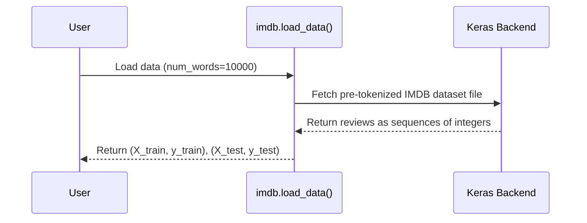
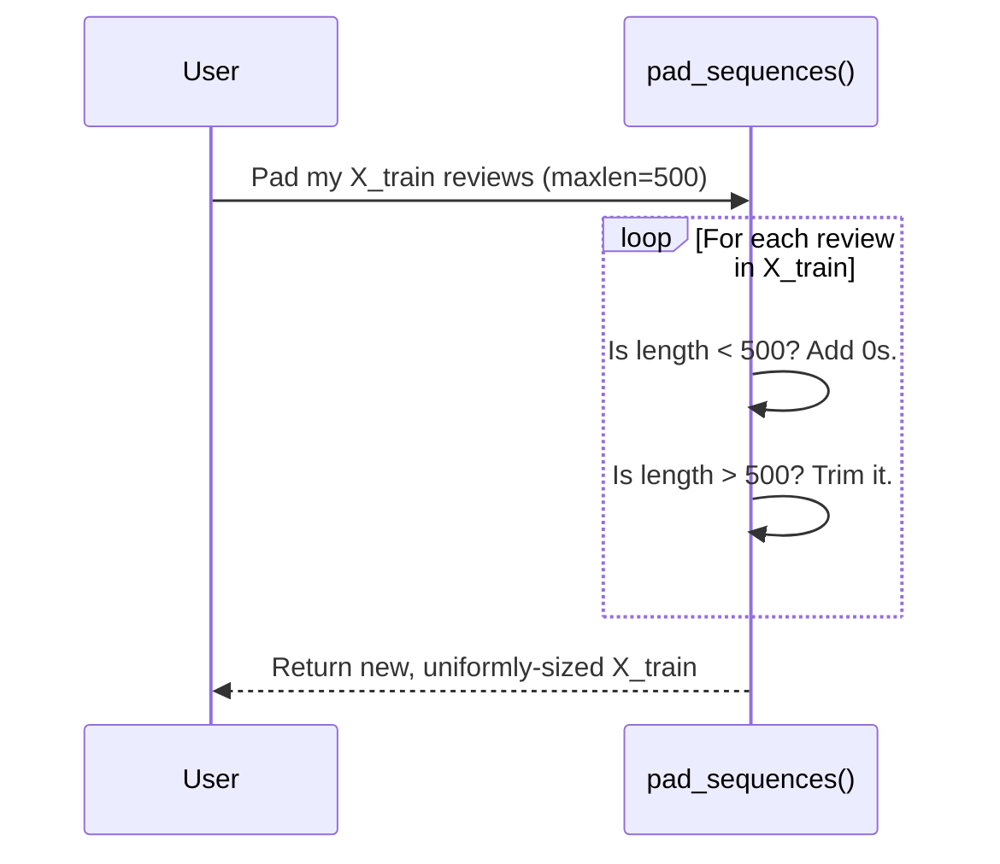

# Chapter 1: IMDB Dataset Loading and Preparation

Welcome to the first step in our journey to build a movie sentiment predictor! Before we can teach a computer to understand if a review is positive or negative, we first need to get the data and prepare it in a way that a machine can understand.

Think of it like this: if you want to bake a cake, you can't just throw a bag of flour, a carton of eggs, and a sugar sack into the oven. You have to measure, mix, and prepare the ingredients first. In this chapter, we'll be the chefs for our data, getting it ready for our Recurrent Neural Network (RNN) model.

Our main goal is to load thousands of movie reviews and make them all look the same to our model.

### What is the IMDB Dataset?

We'll be using the famous IMDB movie review dataset. It's a collection of 50,000 movie reviews from the Internet Movie Database. Half of them are "positive" and the other half are "negative," making it the perfect playground for learning about sentiment analysis.

The best part? TensorFlow and Keras, the libraries we're using, can download and load this dataset for us with just one line of code!

### Step 1: Loading the Dataset

First, let's import the tools we need. We'll need `tensorflow` and the `imdb` dataset module from it.

```python
import tensorflow as tf
from tensorflow.keras.datasets import imdb
```

Now, let's load the data. We'll also tell it to only consider the 10,000 most common words in the reviews. This helps keep our model's vocabulary manageable and avoids super rare words that might not be very useful.

```python
max_features = 10000  # This is our vocabulary size

# This command downloads the data and splits it for us!
(X_train, y_train), (X_test, y_test) = imdb.load_data(num_words=max_features)
```

After running this, Keras automatically downloads the dataset (if you don't have it) and splits it into two parts:
*   **Training set (`X_train`, `y_train`):** This is what we'll use to teach our model. (25,000 reviews)
*   **Testing set (`X_test`, `y_test`):** This is what we'll use to check how well our model learned. (25,000 reviews)

Let's see how many reviews we have in each set.

```python
print(f'Training data shape: {X_train.shape}, Training labels shape: {y_train.shape}')
print(f'Testing data shape: {X_test.shape}, Testing labels shape: {y_test.shape}')
```

This will output:
```
Training data shape: (25000,), Training labels shape: (25000,)
Testing data shape: (25000,), Testing labels shape: (25000,)
```
This confirms we have 25,000 reviews for training and 25,000 for testing.

### Step 2: What Does a Review Look Like?

You might expect to see text, but our computers prefer numbers! The `imdb.load_data()` function is handy because it has already converted all the words in the reviews into integers. This process is called **tokenization**, where each unique word gets a unique number (a "token").

Let's look at the first review in our training data.

```python
# Display the first review
print(X_train[0])
```

The output is a list of numbers, not words!
```
[1, 14, 22, 16, 43, 530, 973, 1622, 1385, 65, ... ]
```
Each number represents a specific word. For example, `14` might be the word "this", `22` might be "film", and so on. The number `1` is special and marks the start of the review.

Now, what about its label? Is this review positive or negative?

```python
# Display the label for the first review
print(y_train[0])
```

The output is:
```
1
```
In this dataset, `1` means a positive review, and `0` means a negative review. So, this long list of numbers corresponds to a positive movie review!

### Step 3: Making All Reviews the Same Length

There's a small problem. Some movie reviews are very short ("Great movie!") and some are very long. If we look at the lengths of the first two reviews, they are different.

Our RNN model, however, is like a machine on an assembly line: it expects every item it processes to be the exact same size. We can't feed it reviews of different lengths.

So, we need to make every review the same length. This is called **padding**.

Here's the plan:
1.  We'll pick a standard length, say `500` words.
2.  If a review is **shorter** than 500 words, we'll add a special value (usually `0`) to the beginning of it until it's 500 words long.
3.  If a review is **longer** than 500 words, we'll cut it off, keeping only the first 500 words.

Let's use a Keras helper function to do this for us.

```python
from tensorflow.keras.preprocessing import sequence

max_len = 500 # The standard length we picked for all reviews

X_train = sequence.pad_sequences(X_train, maxlen=max_len)
X_test = sequence.pad_sequences(X_test, maxlen=max_len)
```
That's it! Now, every single review in both our training and testing sets is exactly `500` numbers long. Let's look at our first review again.

```python
print(X_train[0])
```

The output will now look something like this:
```
[   0    0    0 ... 5345   19  178   32]
```
Notice all the `0`s at the beginning? That's the padding we added to make this review reach the 500-number length.

### Under the Hood: What's Happening?

When we call these simple functions, Keras does some heavy lifting for us. Let's visualize the process.

**1. `imdb.load_data()`**

This function downloads a pre-processed dataset where all the text has already been converted to numbers. The numbers are assigned based on word frequency (e.g., the most common word "the" gets a low number, while a rare word gets a high number).



**2. `pad_sequences()`**

This function iterates through every review, checks its length, and either adds `0`s or truncates it to match `maxlen`.



### Conclusion

Great job! We have successfully loaded our dataset and prepared it for our model. We've learned three key concepts:

1.  **Loading Data**: How to easily fetch a standard dataset using Keras.
2.  **Tokenization**: The idea that words can be represented as numbers.
3.  **Padding**: The technique to make all our data points a uniform length, a crucial step for feeding them into an RNN.

Our data is now like perfectly measured ingredients, ready for the next stage of our recipe. But right now, it's just a bunch of numbers. In the next chapter, we'll write a small helper function to translate these numbers back into words, so we can actually read the reviews and make sense of our data.

Ready to see what these reviews say? Let's move on!

Next: [Chapter 2: decode_review](02_decode_review.md)

---

Generated by [AI Codebase Knowledge Builder](https://github.com/The-Pocket/Tutorial-Codebase-Knowledge)