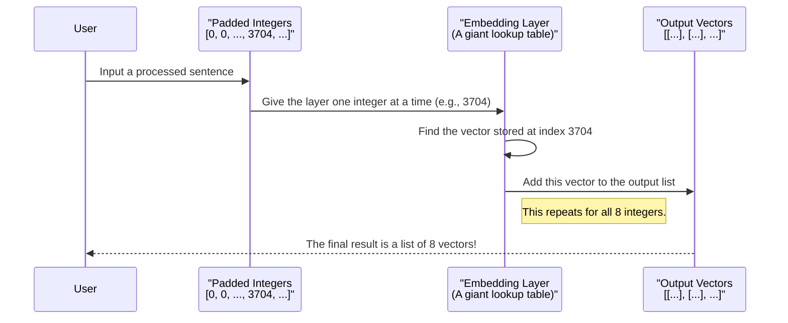

# Chapter 1: Word Embedding Demonstration

Welcome to the first chapter of our journey into predicting movie review sentiment! Before we can build a model to understand reviews, we need to tackle a fundamental problem: computers don't understand words like "good" or "bad." They only understand numbers.

Our first goal is to learn how to translate text into a numerical format that a machine learning model can process. This entire process is often called **"Text Vectorization"** or **"Word Embedding."** Think of it as creating a secret codebook that translates human language into computer language.

In this chapter, we'll walk through a simple, hands-on demonstration of the three key steps involved in this translation:
1.  **Integer Encoding:** Assigning a unique number to each word.
2.  **Sequence Padding:** Making sure every sentence has the same length.
3.  **Embedding:** Turning each number into a rich, meaningful numerical vector.

Let's get started!

### Our Starting Point: Simple Sentences

First, we need some text to work with. Let's define a list of simple sentences in Python. This will be our "dataset" for this demonstration.

```python
### sentences
sent=[  'the glass of milk',
     'the glass of juice',
     'the cup of tea',
    'I am a good boy',
     'I am a good developer',
     'understand the meaning of words',
     'your videos are good',]
```

This code creates a standard Python list named `sent`, where each item is one of our sentences.

### Step 1: Turning Words into Numbers (One-Hot Encoding)

Our first translation step is to give each unique word a number. It's like creating an index for a book. The word "the" might become 3704, "glass" might become 3582, and so on.

We'll use a handy function from Keras called `one_hot` to do this. We just need to tell it how large our "dictionary" or "vocabulary" is. Let's imagine our dictionary has 10,000 words.

```python
from tensorflow.keras.preprocessing.text import one_hot

## Define the vocabulary size
voc_size=10000
```
Here, `voc_size` sets the size of our imaginary dictionary to 10,000. This means every word will be assigned a random integer between 1 and 10,000.

Now, let's apply this to our sentences.

```python
### One Hot Representation
one_hot_repr=[one_hot(words, voc_size) for words in sent]
print(one_hot_repr)
```

**Output:**
```
[[3704, 3582, 3220, 5114], 
 [3704, 3582, 3220, 8282], 
 [3704, 4487, 3220, 9635], 
 [6049, 7075, 6284, 4055, 8349], 
 [6049, 7075, 6284, 4055, 4967], 
 [5232, 3704, 3897, 3220, 825], 
 [1403, 6974, 1625, 4055]]
```

As you can see, each sentence has been converted into a list of numbers! For example, "the glass of milk" is now `[3704, 3582, 3220, 5114]`. Notice that the word "the" (the first word in the first three sentences) is consistently represented by the number `3704`.

We'll explore this concept more deeply in the next chapter on [OneHotRepresentation](02_onehotrepresentation.md).

### Step 2: Making Sentences the Same Length (Padding)

Look closely at our numerical sentences. Some have 4 numbers, some have 5, and one has 6. Machine learning models, especially Recurrent Neural Networks (RNNs), work best when every input has the same, consistent length.

To fix this, we'll use a technique called **padding**. We'll decide on a maximum sentence length and then add "filler" (in our case, the number `0`) to the beginning of any shorter sentences.

Analogy: Imagine you have a set of photos of different sizes, but you need to put them in identical photo frames. You would add a blank border around the smaller photos to make them fit perfectly. That's what padding does for our sentences.

Let's import the necessary function and set our sentence length to 8.

```python
from tensorflow.keras.utils import pad_sequences
import numpy as np

sent_length=8
embedded_docs=pad_sequences(one_hot_repr, padding='pre', maxlen=sent_length)
print(embedded_docs)
```

**Output:**
```
[[   0    0    0    0 3704 3582 3220 5114]
 [   0    0    0    0 3704 3582 3220 8282]
 [   0    0    0    0 3704 4487 3220 9635]
 [   0    0    0 6049 7075 6284 4055 8349]
 [   0    0    0 6049 7075 6284 4055 4967]
 [   0    0    0 5232 3704 3897 3220  825]
 [   0    0    0    0 1403 6974 1625 4055]]
```

Perfect! Now every sentence is exactly 8 numbers long. The shorter sentences have zeros added to the beginning (`padding='pre'`). This uniform structure is exactly what our model needs. We'll cover this in more detail in the chapter on [SequencePadding](03_sequencepadding.md).

### Step 3: Creating Meaning with an Embedding Layer

We have numbers, but they are just IDs. The number 5114 ("milk") has no mathematical relationship to 8282 ("juice"). The model doesn't know that milk and juice are both drinks and are more similar to each other than to the word "developer" (4967).

This is where the magic happens. An **Embedding Layer** is a smart lookup table that converts each word's ID number into a dense vector (a list of numbers). Words with similar meanings will get similar vectors.

Analogy: Instead of just an ID, think of giving each word coordinates on a multi-dimensional map. "Milk" and "juice" would be plotted close together on this map, while "developer" would be plotted far away. The number of coordinates in this map is the "dimension" of our embedding.

Let's build a simple model that contains only an `Embedding` layer to see this in action. We'll set our vector dimension to 10.

First, we import the tools to build a model.
```python
from tensorflow.keras.layers import Embedding
from tensorflow.keras.models import Sequential
```

Next, we define our embedding dimension. This means each word will be represented by a vector of 10 numbers.
```python
## feature representation dimension
dim=10
```

Now, we create our model. It's a simple `Sequential` model with just one layer: the `Embedding` layer.

```python
model=Sequential()
model.add(Embedding(voc_size, dim, input_length=sent_length))
model.compile('adam','mse')
```
Here's what the `Embedding` layer's arguments mean:
*   `voc_size`: The total number of words in our dictionary (10000).
*   `dim`: The size of the vector for each word (10).
*   `input_length`: The length of each input sentence (8).

The `model.compile()` line is just for setting up the model; we don't need to worry about its details right now.

### Putting It All Together: From Numbers to Vectors

Finally, let's pass our padded sentences through the model and see the output.

```python
# The model converts our padded numbers into vectors
model.predict(embedded_docs)
```
The output will be a large block of numbers, but let's look at its shape. It will be `(7, 8, 10)`. This means:
*   **7**: We have 7 sentences.
*   **8**: Each sentence has 8 words (including padding).
*   **10**: Each word is now represented by a 10-dimensional vector.

For our first sentence, `[0, 0, 0, 0, 3704, 3582, 3220, 5114]`, the model looked up the 10-dimensional vector for `0`, then `3704`, then `3582`, and so on, giving us a final list of 8 vectors. These vectors are what a deep learning model can use to truly "understand" the text.

### How It Works: A Quick Look Under the Hood

The process we just saw can be visualized as a simple lookup operation.



Initially, these vectors are random. But when we train a model for a task (like sentiment analysis), the model learns to adjust these vectors so that they capture the true meaning and relationships between words.

### Conclusion

Congratulations! You've just completed a full, end-to-end demonstration of how to prepare text for a neural network. We saw how to:
1.  Convert words into unique integer IDs.
2.  Pad our sentences to make them a uniform length.
3.  Use an `Embedding` layer to transform those IDs into meaningful vectors.

These are the foundational building blocks for almost any task in Natural Language Processing. In the next chapter, we will take a closer look at the first step of this process.

Ready to dive deeper? Let's move on to the next chapter: [OneHotRepresentation](02_onehotrepresentation.md).

---

Generated by [AI Codebase Knowledge Builder](https://github.com/The-Pocket/Tutorial-Codebase-Knowledge)