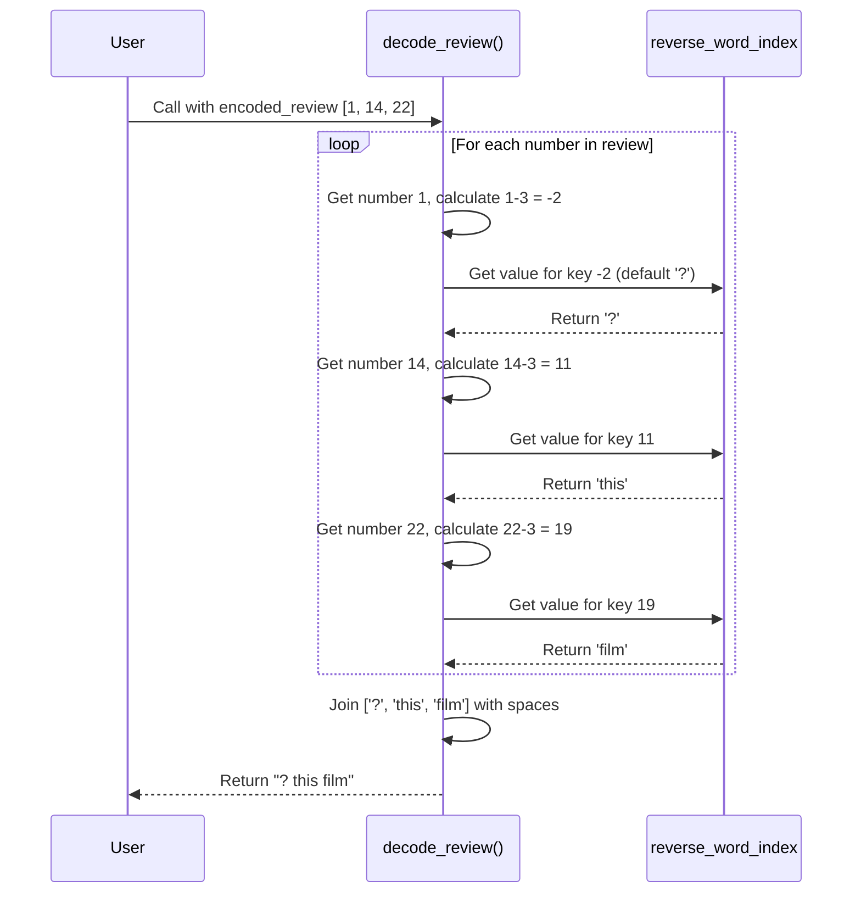

# Chapter 2: Making Sense of the Numbers with `decode_review`

In [Chapter 1: IMDB Dataset Loading and Preparation](01_imdb_dataset_loading_and_preparation.md), we successfully loaded our movie reviews and transformed them into a format that our computer model can understand: lists of numbers.

If you recall, our first review looked like this: `[1, 14, 22, 16, 43, 530, ...]`.

This is great for a machine, but it's complete gibberish to us! How can we check our data? How do we know what this review is actually saying? We need a way to translate these secret codes back into plain English.

Think of it like having a secret decoder ring. You're given a message like "8-5-12-12-15" and a key that says `1=A`, `2=B`, etc. You use the key to translate the numbers back into the word "HELLO". In this chapter, we'll build that exact decoder for our movie reviews.

### The Goal: Building Our Decoder

Our goal is to create a simple helper function, `decode_review`, that takes a list of numbers (like `[1, 14, 22, 16]`) and gives us back a human-readable sentence (like "this film was good"). This will be incredibly useful for debugging and understanding what our model is working with.

### Step 1: Getting the Secret Key (The Word Index)

Keras doesn't leave us in the dark. Along with the dataset, it provides the "secret key" we need: a master list of which number corresponds to which word. This is called the **word index**.

It's a Python dictionary where the keys are words and the values are their corresponding integer codes. Let's load it and take a peek.

```python
from tensorflow.keras.datasets import imdb

# This function fetches the word-to-integer mapping
word_index = imdb.get_word_index()
```

If we were to print a few items from `word_index`, it would look something like this:
```
{'movie': 88, 'film': 19, 'one': 49, 'the': 1, ...}
```
This tells us the word "movie" is encoded as the number `88`, "film" is `19`, and so on.

### Step 2: Flipping the Key (Creating the Reverse Word Index)

The `word_index` is great, but it's backward for our purpose. We have the number and want to find the word, not the other way around. We need to "flip" this dictionary so that the numbers are the keys and the words are the values.

We can do this easily in Python with a dictionary comprehension.

```python
# Create a reverse mapping from integer to word
reverse_word_index = {value: key for key, value in word_index.items()}
```

Now, our `reverse_word_index` looks like this, which is exactly what our decoder needs:
```
{88: 'movie', 19: 'film', 49: 'one', 1: 'the', ...}
```
Perfect! Now if we have the number `88`, we can look it up and get the word "movie".

### Step 3: Handling the Special Characters

There's one small but important detail. The first few numbers in the dataset are reserved for special meanings:
*   `0`: Used for **padding** (the zeros we added to make reviews the same length).
*   `1`: Marks the **start of the sequence**.
*   `2`: Represents an **unknown** word (a word that wasn't in our top 10,000).
*   `3`: Is unused (just a placeholder).

The actual words in our `word_index` start from the integer `4`. This means there's an **offset of 3**. For example, the word `'the'` has an index of `1` in our `reverse_word_index`, but in the actual encoded review data from `imdb.load_data()`, it's represented as `1 + 3 = 4`. Wait, no, the opposite is true. The `word_index` gives `'the': 1`. So to find it from the dataset number, we need to subtract. For example, the start token is `1`, but there is no word for that. The real words start after the special tokens.

Let's clarify this simply: when we get a number from a review, we must **subtract 3** from it before looking it up in our `reverse_word_index`.

For example, if the review has the number `14`, we'll look up `14 - 3 = 11` in our `reverse_word_index`.

### Step 4: Building the `decode_review` Function

Now we have all the pieces to build our decoder function. It will take a list of numbers, loop through each one, look up the corresponding word, and join them all together into a sentence.

```python
# The complete decoder function
def decode_review(encoded_review):
    # We use .get(key, '?') so if a number is not found, it returns '?'
    # instead of causing an error. We also subtract 3 to handle the offset.
    return ' '.join([reverse_word_index.get(i - 3, '?') for i in encoded_review])
```

Let's break down that one line of code:
*   `for i in encoded_review`: This loops through every integer `i` in the review.
*   `i - 3`: It subtracts the offset of 3.
*   `reverse_word_index.get(..., '?')`: It looks up the adjusted number in our reverse index. If it can't find the number (like for the padding value `0`), it uses a `'?'` as a placeholder.
*   `' '.join([...])`: After finding all the words, this joins them together into a single string, with spaces in between.

### Let's Try It Out!

Let's grab the first review from our training set (which we know is a list of numbers) and see what it actually says.

```python
# First, we need to load the data again to get the original, un-padded review
(X_train, y_train), (X_test, y_test) = imdb.load_data(num_words=10000)

# Let's decode the first review
decoded_text = decode_review(X_train[0])

print(decoded_text)
```

**Output:**
```
? this film was just brilliant casting location scenery story direction everyone's really suited the part they played and you could just imagine being there robert ? is an amazing actor and now the same being director ? father came from the same scottish island as myself so i loved the fact there was a real connection with this film the witty remarks throughout the film were great it was just brilliant so much that i bought the film as soon as it was released for ? and would recommend it to everyone to watch and the fly fishing was amazing really cried at the end it was so sad and you know what they say if you cry at a film it must have been good and this definitely was also ? to the two little boy's that played the ? of norman and paul they were just brilliant children are often left out of the ? list i think because the stars that play them all grown up are such a big profile for the whole film but these children are amazing and should be praised for what they have done don't you think the whole story was so lovely because it was true and was someone's life after all that was shared with us all
```
Success! It's a real movie review. The `?` marks represent words that were either unknown or special tokens like the start-of-sequence marker. Now we can finally read our data!

### Under the Hood

The `decode_review` function is a straightforward process. Let's visualize what happens when we call it with a short, encoded review like `[1, 14, 22]`.



The code for this function can be found in `main.py` and `prdictions.ipynb`. It's a crucial utility for making the project's output understandable.

### Conclusion

In this chapter, we built a powerful tool. We learned:
1.  **Word Index**: Keras provides a word-to-number mapping dictionary.
2.  **Reverse Word Index**: How to "flip" the dictionary to create a number-to-word mapping, which is what we need for decoding.
3.  **Decoding**: How to combine the reverse index with knowledge of the special character offset to create a `decode_review` function that translates machine-code back into English.

While our RNN model will work with the numbers, this decoder function is our window into its world. It allows us to sanity-check our data and, later, to understand the predictions our model makes.

We now have our data prepared and we can understand it. But how does a machine learn the *meaning* behind words like "brilliant" and "sad"? In the next chapter, we'll dive into a fascinating concept called embeddings, which is how our model begins to understand the relationships between words.

Next: [Chapter 3: Word Embedding Exploration](03_word_embedding_exploration.md)

---

Generated by [AI Codebase Knowledge Builder](https://github.com/The-Pocket/Tutorial-Codebase-Knowledge)