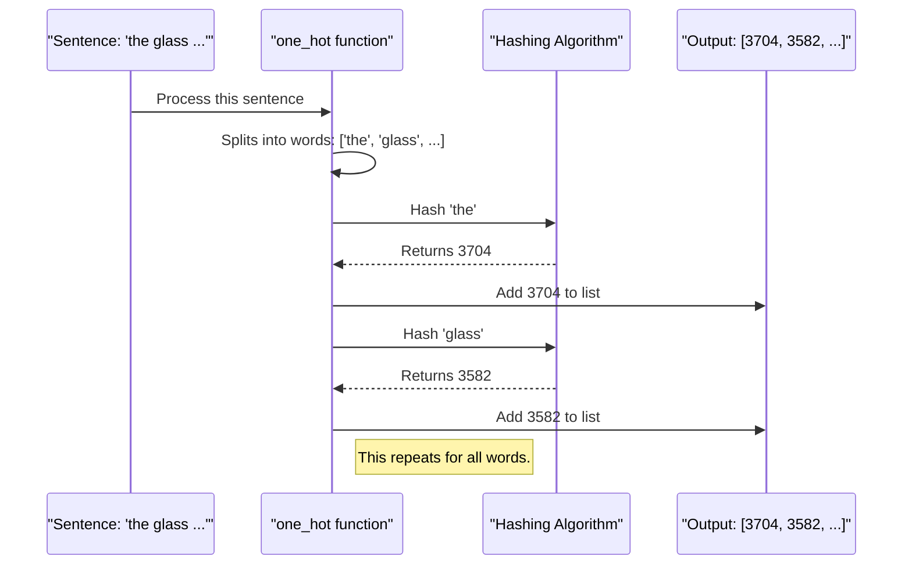

# Chapter 2: One-Hot Representation

In [Chapter 1: Word Embedding Demonstration](01_wordembeddingdemonstration.md), we took a whirlwind tour of the three key steps to prepare text for a machine learning model. We saw how to turn words into numbers, make sentences the same length, and then transform those numbers into meaningful vectors.

Now, let's zoom in on that very first, crucial step: **turning words into numbers**. This process is the foundation for everything that follows.

### Why Do We Need This Step?

Imagine you're building a simple machine to sort fruit. You have apples, bananas, and oranges. You can't just tell the machine "sort the apples." The machine needs a code. You might decide on a simple system:
*   Apple = 1
*   Banana = 2
*   Orange = 3

Now, you can give the machine the number `1`, and it knows you're talking about an apple. We need to do the exact same thing for words. Our goal is to create a unique numerical ID for every word in our vocabulary.

In our project, we use a Keras function called `one_hot` to achieve this. Let's see it in action again.

### The Code in Action

First, let's remember our starting point: a list of simple sentences.

```python
### Our sample sentences
sent=[  'the glass of milk',
     'the glass of juice',
     'the cup of tea',
    'I am a good boy',
     'your videos are good',]
```
Next, we need to import the `one_hot` function and define our "vocabulary size." Think of this as the size of our dictionary. We're telling the function that we want to map every word to a unique number between 1 and 10,000.

```python
from tensorflow.keras.preprocessing.text import one_hot

## Define the vocabulary size (our dictionary size)
voc_size=10000
```
A larger `voc_size` reduces the chance of two different words accidentally getting the same number.

Finally, we apply the function to each of our sentences. The code below uses a Python trick called a "list comprehension" to do this in a single, clean line. It just means "for each sentence in our list `sent`, apply the `one_hot` function to it."

```python
### Create the One-Hot Representation
one_hot_repr=[one_hot(words, voc_size) for words in sent]

print(one_hot_repr)
```
**Output:**
```
[[3704, 3582, 3220, 5114], 
 [3704, 3582, 3220, 8282], 
 [3704, 4487, 3220, 9635], 
 [6049, 7075, 6284, 4055, 8349], 
 [1403, 6974, 1625, 4055]]
```
Look at the result! Each sentence is now a list of numbers. More importantly, the mapping is consistent.
*   The first word in the first three sentences is "the", and it is always mapped to `3704`.
*   The word "good" appears in the last two sentences, and it is always mapped to `4055`.

This is exactly what we wanted: a unique, consistent ID for each word.

### What's Under the Hood?

You might be wondering, "How does the `one_hot` function know which number to assign to each word?" It uses a clever and fast technique called **hashing**.

You don't need to be a math expert to understand hashing. Imagine a machine that takes in any word and instantly spits out a number.

1.  **Input:** You give it the word "glass".
2.  **Process:** The machine performs a special, consistent mathematical calculation on the letters 'g', 'l', 'a', 's', 's'.
3.  **Output:** It spits out a number, like `3582`.

If you give it the word "glass" again, it will *always* spit out `3582`. If you give it "juice", it will perform a different calculation and spit out a different number, like `8282`.

This hashing process is what allows the `one_hot` function to work so quickly without needing to build a visible dictionary beforehand.

Here’s a simple diagram of the process for a single sentence:



#### A Quick Note on the Name

The name `one_hot` can be a little confusing. In machine learning, "one-hot encoding" usually means creating a giant vector of all zeros and a single `1`. For example, the word "the" (ID 3704) would become a vector of length 10,000 that looks like `[0, 0, ..., 1, 0, ...]`, where the `1` is at the 3704th position.

Keras's `one_hot` function **does not** do this. It only performs the first step: **assigning the integer ID**. This is more accurately called **Integer Encoding**. We use the integer IDs as a stepping stone to the more powerful `Embedding` layer we saw in Chapter 1.

### Conclusion

Great work! You've now taken a closer look at the first and most fundamental step of text preparation. You've learned:
*   **Why** we need to convert words to numbers.
*   **How** to use Keras's `one_hot` function to perform integer encoding.
*   **What** happens under the hood (hashing) to make this process fast and efficient.

But take another look at our output. The lists of numbers have different lengths! The first sentence has 4 numbers, while the fourth has 5. Our model needs every input to be the same size. How do we fix that?

That's exactly what we'll cover in the next chapter. Let's move on to [Chapter 3: Sequence Padding](03_sequencepadding.md).

---

Generated by [AI Codebase Knowledge Builder](https://github.com/The-Pocket/Tutorial-Codebase-Knowledge)