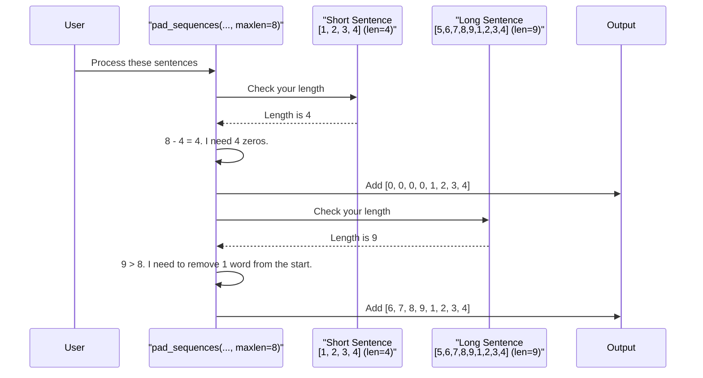

# Chapter 3: Sequence Padding

In the [previous chapter on One-Hot Representation](02_onehotrepresentation.md), we successfully converted our sentences from words into lists of numbers. It was a huge step! But we were left with a new problem.

Take a look at our numerical sentences again:
```
[[3704, 3582, 3220, 5114],          # Length: 4
 [6049, 7075, 6284, 4055, 8349],      # Length: 5
 [1403, 6974, 1625, 4055]]           # Length: 4
```
They all have different lengths! This is a problem for most machine learning models.

### Why Uniform Length Matters

Imagine you're running an assembly line that packages gift boxes. To work efficiently, the machine is designed to handle boxes that are *exactly* the same size. If you suddenly send a tiny box or an oversized box down the line, the machine will jam.

Our neural network is like that assembly line. It's built to expect input data of a fixed, consistent shape. It needs all our "sentences" to have the same length so it can process them smoothly.

Our solution is simple: we'll make all our sentences the same length by adding "filler" to the shorter ones and trimming the longer ones. This process is called **Sequence Padding**.

### The Code in Action: `pad_sequences`

Keras gives us a perfect tool for this job called `pad_sequences`. Let's see how it works.

First, let's import the function. We'll also need `numpy`, a popular Python library for working with numbers.

```python
from tensorflow.keras.utils import pad_sequences
import numpy as np
```

Next, we need to decide on our target length. Let's say we want every sentence to be 8 words long.

```python
# Our list of number-sentences from the previous chapter
one_hot_repr=[[3704, 3582, 3220, 5114], [6049, 7075, 6284, 4055, 8349], ...]

# Define our target sentence length
sent_length=8
```

Now, we can call the function. We'll give it our sentences and tell it our desired length.

```python
embedded_docs=pad_sequences(one_hot_repr, padding='pre', maxlen=sent_length)
print(embedded_docs)
```

**Output:**
```
[[   0    0    0    0 3704 3582 3220 5114]
 [   0    0    0 6049 7075 6284 4055 8349]
 [   0    0    0    0 3704 4487 3220 9635]
 ... and so on ... ]
```

Look at that! Every single list is now exactly 8 numbers long.
*   The first sentence, which had 4 numbers, now has four `0`s added to the **beginning**.
*   The second sentence, which had 5 numbers, now has three `0`s added to the **beginning**.

The `0` is our "filler" or "padding" value. We've successfully resized all our boxes to be the same size for our assembly line!

#### Understanding the Options

Let's quickly look at the key arguments we used:
*   `one_hot_repr`: This is our input list of uneven sentences.
*   `maxlen=8`: This sets the target length. Every sentence will become 8 numbers long.
*   `padding='pre'`: This is the most interesting part. It tells the function to add the filler `0`s at the **beginning** (pre) of the sentence. The alternative is `padding='post'`, which would add them at the end. For Recurrent Neural Networks (RNNs), it's often better to use `'pre'` so the model sees the actual words last, which can help it remember them better.

What if a sentence is longer than `maxlen`? `pad_sequences` handles that too! It will automatically **truncate** (cut off) words from the beginning to make it fit.

### How It Works Under the Hood

The logic inside `pad_sequences` is very straightforward. Let's visualize what happens when it processes two sentences with a `maxlen` of 8.



The function simply goes through each sequence one by one and either adds zeros or removes elements to make it conform to the `maxlen`.

### Connection to Our IMDB App

This isn't just a theoretical exercise. This exact process is critical for making our sentiment analysis app work. In the `main.py` file, there's a function called `preprocess_text` that prepares the user's movie review for the model. Look at the last line:

```python
# A simplified snippet from main.py
def preprocess_text(text):
    # ... other steps to turn words into numbers ...
    encoded_review = [word_index.get(word, 2) + 3 for word in words]
    
    # Here it is!
    padded_review = sequence.pad_sequences([encoded_review], maxlen=500)
    return padded_review
```

Our trained model was built to handle reviews that are **500 words long**. So, when a user types in a review (which could be 20 words or 1000 words), this function uses `pad_sequences` to ensure it's resized to exactly 500 numbers before being sent to the model for prediction. Without this step, our app would crash!

### Conclusion

You've now mastered the second key step in text preparation! You learned:
*   **Why** machine learning models need inputs of a uniform length.
*   **What** sequence padding is and how it solves this problem.
*   **How** to use the `pad_sequences` function to make all your sentences the same size.

Our data is now in perfect shape: a clean, uniform list of numbers. But these numbers are still just IDs. The number `3704` ("the") has no mathematical relationship to `3582` ("glass"). How do we add real meaning to these numbers?

That's the final and most exciting step, which involves the `Embedding` layer. Let's dive in and build a simple model to see it in action in the next chapter: [EmbeddingLayerModel](04_embeddinglayermodel.md).

---

Generated by [AI Codebase Knowledge Builder](https://github.com/The-Pocket/Tutorial-Codebase-Knowledge)