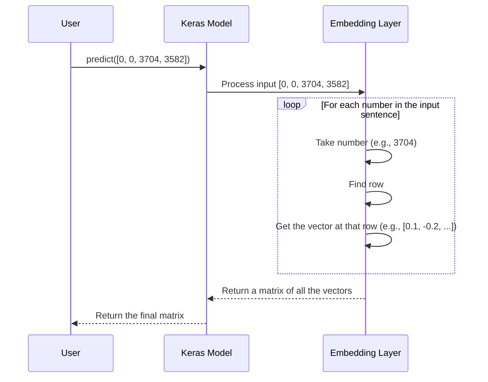

# Chapter 3: Word Embedding Exploration

In [Chapter 2: Making Sense of the Numbers with `decode_review`](02_decode_review.md), we built a decoder to turn our model's numerical data back into human-readable words. We saw that our reviews are just lists of numbers, like `[1, 14, 22, 16]`.

But this brings up a big question: how does a computer actually *understand* these numbers? For the model, the number `14` (for "this") and `19` (for "film") are just random IDs. It has no idea that "film" is very similar to "movie," but very different from "juice." How can we teach it the relationships and meanings behind words?

This is where the magic of **Word Embeddings** comes in.

### The Problem: Numbers Have No Meaning

Imagine you're building a bookshelf and you label your books with numbers. Book #5 is a sci-fi novel, and book #6 is a cookbook. To you, the numbers 5 and 6 are close, but the books' topics are completely different. The number itself tells you nothing about the book's content.

This is the same problem our RNN model faces. It sees the number for "good" and the number for "great," but it has no built-in knowledge that these words have similar, positive meanings. We need a smarter way to represent words.

### The Solution: A "Map" of Words

Instead of using a single number, what if we could represent each word with coordinates on a map?

On this map, words with similar meanings would be placed close together.
*   "King" and "Queen" would be neighbors.
*   "Walking" and "Running" would be close.
*   "Happy" and "Joyful" would be clustered together.

This "map" is exactly what a word embedding is! Instead of a 2D map, we use a multi-dimensional space (imagine a map with 50 or 100 axes!). Each word is represented not by a single number, but by a list of numbers called a **vector**. This vector is its coordinate in this high-dimensional "meaning space."

This chapter explores this concept using the `Word_Embeddings.ipynb` notebook, which provides a simplified demonstration.

### Step 1: Getting Some Sample Sentences

To understand this big idea, let's start with a tiny example, much smaller than our 50,000 movie reviews.

```python
# Our sample sentences
sent = [
    'the glass of milk',
    'the glass of juice',
    'the cup of tea',
    'I am a good boy',
    'I am a good developer'
]
```
Here, we can see that "milk" and "juice" are used in a similar context. "Boy" and "developer" are also used similarly. Our goal is to get our model to learn these relationships automatically.

### Step 2: Turning Words into Numbers

Just like with the IMDB dataset, our first step is to convert the words into numbers. We'll use a Keras helper function called `one_hot` which assigns a unique number (an index) to each word.

We also need to define a **vocabulary size**, which is the maximum number of unique words we want our model to know.

```python
from tensorflow.keras.preprocessing.text import one_hot

voc_size = 10000 # Our dictionary can hold 10,000 unique words

one_hot_repr = [one_hot(words, voc_size) for words in sent]
print(one_hot_repr)
```

**Output:**
```
[[3704, 3582, 3220, 5114], 
 [3704, 3582, 3220, 8282], 
 [3704, 4487, 3220, 9635], 
 [6049, 7075, 6284, 4055, 8349], 
 [6049, 7075, 6284, 4055, 4967]]
```
Now each sentence is a list of numbers. For example, in the first two sentences, the words "the", "glass", and "of" got the same numbers (`3704`, `3582`, `3220`), while "milk" (`5114`) and "juice" (`8282`) got different ones.

### Step 3: Making Sentences the Same Length (Padding)

You've seen this before in [Chapter 1](01_imdb_dataset_loading_and_preparation.md)! Our sentences have different lengths, but our model needs them to be uniform. We'll **pad** them with zeros at the beginning to make them all have the same length.

```python
from tensorflow.keras.utils import pad_sequences

sent_length = 8
embedded_docs = pad_sequences(one_hot_repr, padding='pre', maxlen=sent_length)
print(embedded_docs)
```
**Output:**
```
[[   0    0    0    0 3704 3582 3220 5114]
 [   0    0    0    0 3704 3582 3220 8282]
 [   0    0    0    0 3704 4487 3220 9635]
 [   0    0    0 6049 7075 6284 4055 8349]
 [   0    0    0 6049 7075 6284 4055 4967]]
```
Now every sentence is exactly 8 numbers long. We're ready for the main event!

### Step 4: The `Embedding` Layer - The Word Map Maker

This is the core of our chapter. Keras has a magical layer called `Embedding` that does exactly what we need: it turns our integer indices into dense meaning-vectors.

Think of the `Embedding` layer as a giant lookup table or a dictionary.
*   **Keys**: The word indices (e.g., `3704`).
*   **Values**: The meaning-vectors (e.g., `[0.1, -0.5, 0.8, ...]`).

When you give it the number `3704`, it looks up the 3704th row in its table and gives you back the vector stored there.

The most incredible part? The model **learns** the best vectors during training! They start as random numbers, but as the model gets better at predicting sentiment, it adjusts the vectors. Words that appear in positive reviews will get vectors that point in a "positive" direction, and words like "terrible" will get vectors that point in a "negative" direction.

Let's create one.

```python
from tensorflow.keras.layers import Embedding
from tensorflow.keras.models import Sequential

dim = 10 # Each word will be represented by a 10-number vector

model = Sequential()
model.add(Embedding(voc_size, dim, input_length=sent_length))
model.compile('adam', 'mse') # We need to compile it to use it
```
Let's break down the `Embedding` layer's arguments:
*   `voc_size`: (10000) "My lookup table needs 10,000 rows, one for each possible word."
*   `dim`: (10) "Each word's meaning-vector should have 10 numbers."
*   `input_length`: (8) "I expect to receive sentences that are 8 numbers long."

### Step 5: See the Vectors!

Now, let's pass our padded sentences through the model to see the output. The `Embedding` layer will transform our list of numbers into a list of vectors.

```python
# model.predict() will apply the Embedding layer to our data
vector_output = model.predict(embedded_docs)

print(vector_output.shape)
```
**Output:**
```
(5, 8, 10)
```
This shape tells us we have:
*   `5` sentences.
*   `8` words in each sentence.
*   `10` numbers (our vector) representing each word.

Let's look at the vector for just the last word ("developer") in the last sentence.
```python
# Get the last sentence, then the last word's vector
last_word_vector = vector_output[4][-1]

print(last_word_vector)
```
**Output:**
```
[ 0.04450871  0.04168308 -0.0087567  ... -0.01913982]
```
That list of 10 numbers is the "meaning" of the word "developer" as represented by our untrained `Embedding` layer. As we train our final model, this vector will change to better capture its meaning in the context of movie reviews.

### Under the Hood: The Lookup Table

Let's visualize what the `Embedding` layer does when it receives one of our padded sentences, like `[0, ..., 3704, 3582]`.



This simple lookup process is incredibly efficient and is the first and most important step in any modern language model.

### Conclusion

In this chapter, we've unlocked one of the most fundamental concepts in Natural Language Processing. We've learned that:

1.  Representing words as single numbers (`19` for "film") is not enough because the numbers themselves have no meaning.
2.  **Word Embeddings** solve this by mapping each word to a dense vector (a list of numbers) that captures its meaning.
3.  The **Keras `Embedding` layer** is a powerful tool that acts as a lookup table to turn word indices into these meaningful vectors.
4.  Crucially, the model learns the best vector representations for words as it trains on data.

We now have all the conceptual building blocks. We have our data prepared, we know how to decode it, and we understand how the model can learn the meaning of words. It's finally time to assemble these pieces into our complete model.

Ready to build the brain of our operation?

Next: [Chapter 4: RNN Sentiment Analysis Model](04_rnn_sentiment_analysis_model.md)

---

Generated by [AI Codebase Knowledge Builder](https://github.com/The-Pocket/Tutorial-Codebase-Knowledge)