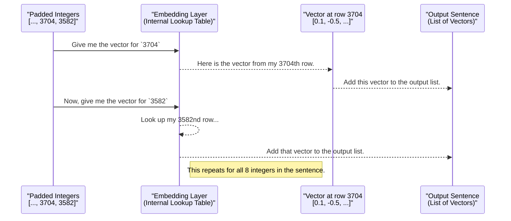

# Chapter 4: The Embedding Layer Model

We've come a long way! In the [previous chapter on Sequence Padding](03_sequencepadding.md), we successfully formatted our data into perfectly uniform lists of numbers. Our data is now neat and tidy, ready for a machine learning model.

But there's still a missing piece. The number `5114` (for "milk") and `8282` (for "juice") are just arbitrary IDs. The numbers themselves don't tell the model that milk and juice are both drinks and are conceptually closer to each other than to, say, "developer" (`4967`).

How do we teach a computer about the *meaning* and *relationships* between words? The answer is the **Embedding Layer**.

### From ID Numbers to Meaningful Vectors

The goal of an `Embedding` layer is to solve this "meaning" problem. It converts each integer ID into a dense **vector** (a list of floating-point numbers). This isn't just any random list of numbers; it's a rich, numerical representation of the word's meaning.

Analogy: Think of it like this:
*   An **integer ID** (`5114`) is like a library card number. It uniquely identifies a book but tells you nothing about it.
*   An **embedding vector** (`[-0.2, 0.5, 0.9, ...]`) is like a detailed summary of that book: its genre, themes, main characters, and writing style.

Words with similar meanings will have similar vectors. By comparing these vectors, a model can understand that "good" and "great" are similar, while "good" and "terrible" are opposites. This is the final and most powerful step in preparing text for a neural network.

### The Code in Action: Building a Simple Model

To see this transformation happen, we'll build the simplest possible Keras model: a `Sequential` model that contains *only* an `Embedding` layer. This will let us isolate and observe exactly what the layer does.

First, let's import the necessary tools from TensorFlow/Keras.

```python
from tensorflow.keras.layers import Embedding
from tensorflow.keras.models import Sequential
```
*   `Sequential`: This is a container for building a model layer by layer, like stacking LEGO bricks.
*   `Embedding`: This is the special layer that will do all the work.

Next, we need to define the "dimension" of our vectors. This is how many numbers will be in the vector for each word. Let's choose 10 for this demonstration.

```python
## The size of the vector for each word
dim=10
```
This means every word in our vocabulary will be represented by a list of 10 numbers.

Now, let's create our model and add the `Embedding` layer to it.

```python
model=Sequential()
model.add(Embedding(voc_size, dim, input_length=sent_length))
```
This is the most important part. Let's break down what we told the `Embedding` layer:
*   `voc_size`: The first argument is our vocabulary size (we set it to `10000` in previous chapters). The layer needs to know how many unique words it needs to create vectors for.
*   `dim`: The second argument is the dimension we just defined (`10`). It sets the length of each word's vector.
*   `input_length`: This is the length of our padded sentences (`8`). The layer needs to know how many words to expect in each input sentence.

Finally, we need to `compile` the model. This is a standard setup step in Keras. For now, you can think of it as just finalizing the model's blueprint.

```python
model.compile('adam','mse')
```

Our model is ready! It's a simple machine designed to do one thing: take our padded integer sentences and convert them into sentences of embedding vectors.

### Putting It All Together: The Transformation

Let's feed our `embedded_docs` (the padded integer sentences from Chapter 3) into this model and see what comes out.

```python
# Pass the padded sentences through the model
word_vectors = model.predict(embedded_docs)

# Let's look at the shape of the result
print(word_vectors.shape)
```
**Output:**
```
(7, 8, 10)
```

This output tells us everything! It's a 3-dimensional block of numbers:
*   **7**: We started with 7 sentences.
*   **8**: Each sentence has 8 words (including the zero-padding).
*   **10**: Each of those 8 words is now represented by a 10-dimensional vector.

We successfully transformed our data from `(7, 8)` integers into `(7, 8, 10)` floating-point vectors. This is the format that a Recurrent Neural Network (RNN) can use to truly understand the text.

### How It Works: A Look Under the Hood

So what is the `Embedding` layer really doing? At its heart, it's just a very clever **lookup table**.

When we created the layer, it secretly built a large table (a matrix) with `voc_size` rows and `dim` columns. That's 10,000 rows and 10 columns in our case. Each row corresponds to a word's integer ID, and the values in that row are the word's vector. Initially, these vectors are just small random numbers.

When we call `model.predict()`, the following happens for each sentence:



#### The Magic of Training

You might be asking, "If the vectors start as random numbers, how are they meaningful?"

This is the most brilliant part. When we build our full [SentimentPredictionModel](08_sentimentpredictionmodel.md) and train it on thousands of movie reviews, the model's training process **automatically adjusts the numbers in these vectors**. It learns to shift the vectors around so that words appearing in similar contexts (e.g., "amazing", "wonderful", "excellent") end up with similar vectors. This is how the layer learns the meaning of words *specifically for our task of sentiment analysis*.

### Conclusion

Congratulations! You've now completed the entire text preparation pipeline and seen the final, crucial transformation. You've learned:
*   **Why** we need to move from simple integer IDs to meaningful vectors.
*   **What** an `Embedding` layer is: a smart lookup table that maps IDs to vectors.
*   **How** to build a simple Keras model to see this layer in action.
*   **That** the real power of these vectors comes from adjusting them during model training.

So far, we've used a small, temporary vocabulary (`voc_size=10000`). For our real project, we need to use the actual vocabulary from the IMDB dataset. How do we load and use that? Let's find out in the next chapter.

Ready to see the real data? Let's move on to [Chapter 5: IMDB Word Index](05_imdbwordindex.md).

---

Generated by [AI Codebase Knowledge Builder](https://github.com/The-Pocket/Tutorial-Codebase-Knowledge)