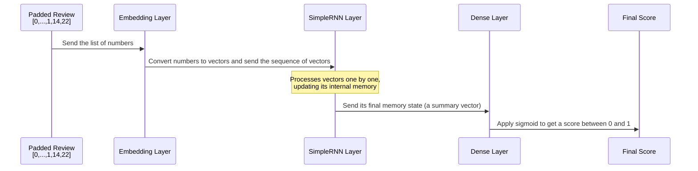

# Chapter 4: RNN Sentiment Analysis Model

In [Chapter 3: Word Embedding Exploration](03_word_embedding_exploration.md), we discovered the magic of word embeddings, which allow our model to understand the *meaning* and relationships between words by turning them into vectors.

We now have all our ingredients ready:
1.  **Prepared Data**: Padded, numerical reviews (from Chapter 1).
2.  **Meaningful Words**: A way to convert word numbers into meaning-vectors (from Chapter 3).

It's finally time to build the "brain" of our operation! In this chapter, we will assemble these pieces into a complete model that can read a movie review and decide if it's positive or negative. This is the heart of our project, and we'll build it using a **Recurrent Neural Network (RNN)**.

### The Goal: Building a Sentence-Reading Machine

Imagine how you read a sentence. You don't just look at a jumble of words. You read them one by one, in order, and your understanding builds up as you go.

*   When you read "This movie was not...", you anticipate that something negative might follow.
*   The word "not" completely changes the meaning of what comes next. "good" becomes "not good."

Our model needs to do the same thing: process words sequentially and remember the context. A standard neural network might just look at all the words at once, but an RNN is specially designed to handle sequences, making it perfect for understanding language.

### Step 1: Stacking the Layers with Keras

We will use Keras's `Sequential` model API. Think of this like building with LEGO bricks. You create an empty base and then stack different layers on top of each other, where each layer performs a specific job. Our model will have three main layers.

First, let's import the tools we'll need from TensorFlow and Keras.

```python
from tensorflow.keras.models import Sequential
from tensorflow.keras.layers import Embedding, SimpleRNN, Dense
```
This imports the `Sequential` model builder and the three types of "LEGO bricks" (layers) we'll use.

### Step 2: Creating the Model Architecture

Let's define our model, piece by piece. The code for this can be found in the `simple-rnn.ipynb` notebook.

First, we initialize an empty model.

```python
model = Sequential()
```
Now we have our empty base, ready for the layers.

#### Layer 1: The `Embedding` Layer (The Translator)

This is our entrance gate. As we learned in the last chapter, its job is to take our padded reviews (lists of numbers) and translate each number into a dense, meaningful vector.

```python
# From our data preparation
max_features = 10000 # Vocabulary size
max_len = 500        # Length of each review

# Add the Embedding layer
model.add(Embedding(max_features, 128, input_length=max_len))
```
*   `max_features (10000)`: Our dictionary has 10,000 words.
*   `128`: Each word will be translated into a 128-dimensional vector. This number is a common choice; it's big enough to capture complex meanings but not so big that the model becomes too slow.
*   `input_length (500)`: It expects each review to be 500 numbers long.

#### Layer 2: The `SimpleRNN` Layer (The Memory)

This is the core of our model. The `SimpleRNN` layer will read the sequence of 128-dimensional vectors coming from the `Embedding` layer, one vector (word) at a time. It has a "memory" (called a hidden state) that it updates as it reads each word. This memory allows it to remember the context of the sentence so far.

```python
# Add the RNN layer
model.add(SimpleRNN(128, activation='relu'))
```
*   `128`: This is the number of "memory units" in the RNN. You can think of it as the "size" of its memory. It should be powerful enough to remember the important parts of a 500-word review.
*   `activation='relu'`: This is a standard setting that helps the model learn more efficiently.

#### Layer 3: The `Dense` Layer (The Decision Maker)

After the RNN has processed the entire 500-word review, it has formed a final "thought" or summary of the review, stored in its memory. We now need a final layer to take this summary and make a decision: is the review positive (1) or negative (0)?

That's the job of the `Dense` layer.

```python
# Add the final output layer
model.add(Dense(1, activation='sigmoid'))
```
*   `1`: We want a single output number.
*   `activation='sigmoid'`: This is a crucial part! The sigmoid function takes any number and squishes it into a value **between 0 and 1**. This is perfect for us, as we can interpret the output as a probability.
    *   A value close to `1` (e.g., `0.98`) means "Highly confident this is a positive review."
    *   A value close to `0` (e.g., `0.05`) means "Highly confident this is a negative review."

### Step 3: Reviewing Our Model's Blueprint

We've built our model! We can now print a summary of the architecture we just created.

```python
model.summary()
```

The output will look something like this:

```
Model: "sequential"
_________________________________________________________________
 Layer (type)                Output Shape              Param #   
=================================================================
 embedding (Embedding)       (None, 500, 128)          1280000   
                                                                 
 simple_rnn (SimpleRNN)      (None, 128)               32896     
                                                                 
 dense (Dense)               (None, 1)                 129       
                                                                 
=================================================================
Total params: 1,313,025
Trainable params: 1,313,025
Non-trainable params: 0
_________________________________________________________________
```
This summary is a great way to double-check our work. It shows the layers in order, the shape of the data as it flows through them, and the number of parameters (weights) the model will learn during training.

### Under the Hood: The Flow of Data

Let's visualize how a single movie review travels through our model.

Imagine we feed it the review: `[0, 0, ..., 1, 14, 22]` ("...this film was").



1.  **Input**: The model receives a padded review, which is a list of 500 integers.
2.  **Embedding Layer**: It looks up each integer and replaces it with a 128-number vector. The output is now a `500x128` matrix of vectors.
3.  **SimpleRNN Layer**: It reads this matrix one vector at a time, from word 1 to word 500. It continuously updates its internal 128-number memory vector. After the last word, this memory vector represents the meaning of the entire review.
4.  **Dense Layer**: It takes the final 128-number memory vector from the RNN and converts it into a single number.
5.  **Output**: The sigmoid function squishes this number to be between 0 and 1, giving us our final sentiment score.

### Conclusion

Congratulations! You have just designed a complete neural network capable of reading and understanding human language. We've learned how to:

1.  **Structure a model** using the Keras `Sequential` API.
2.  Combine an `Embedding` layer to handle word meanings, a `SimpleRNN` layer to process sequences, and a `Dense` layer to make a final classification.
3.  Understand the role of the **sigmoid activation function** in producing a final probability-like score.

Our model's architecture is now defined, but it's like an empty brain. It has all the right connections, but it doesn't know anything yet. It has no idea which words are positive or negative.

In the next chapter, we will take this model and train it on our 25,000 movie reviews. This is where the learning happens!

Next: [Chapter 5: Model Training Pipeline](05_model_training_pipeline.md)

---

Generated by [AI Codebase Knowledge Builder](https://github.com/The-Pocket/Tutorial-Codebase-Knowledge)