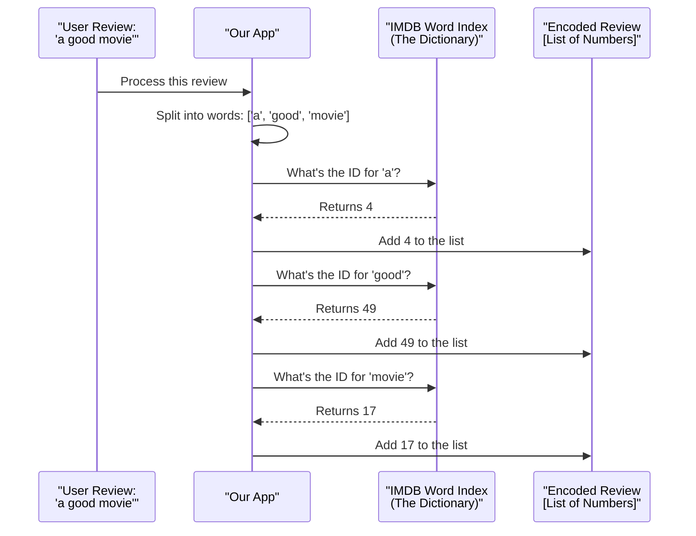

# Chapter 5: The IMDB Word Index

In the [previous chapter on the Embedding Layer Model](04_embeddinglayermodel.md), we saw how an `Embedding` layer transforms simple integer IDs into rich, meaningful vectors. It was the final step in preparing our data for a neural network.

However, all our examples so far have used a temporary, generic vocabulary. We used a Keras function that assigned random numbers to words. But for our sentiment analysis app to work, we need to use the *exact* same word-to-number mapping that the original model was trained on.

How do we get access to this official "codebook"? That's where the **IMDB Word Index** comes in.

### The Problem: We Need a Consistent Codebook

Imagine you and a friend agree to communicate using a secret code where `A=1`, `B=2`, `C=3`, etc. If you send the message `8-5-12-12-15` ("HELLO"), your friend can easily decode it.

But what if your friend suddenly starts using a *different* codebook where `A=26`, `B=25`, etc.? Your message would become gibberish. The same is true for our model. It was trained using a very specific codebook. When a user gives our app a new review, we **must** use that exact same codebook to translate their words into numbers.

The IMDB Word Index is this official codebook. It's a massive dictionary provided by Keras that maps every word in the IMDB dataset's vocabulary to a unique integer ID.

### The Code in Action: Loading the Dictionary

Getting this codebook is surprisingly simple. Keras includes it as part of its built-in datasets.

First, we need to import `imdb` from `tensorflow.keras.datasets`.

```python
from tensorflow.keras.datasets import imdb
```
This line gives us access to the IMDB dataset tools.

Now, we can load the word index with a single command.

```python
# This downloads and loads the official word-to-number dictionary
word_index = imdb.get_word_index()
```
That's it! The variable `word_index` is now a giant Python dictionary. It contains thousands of words as keys and their corresponding integer IDs as values.

Let's test it out! We can look up a few words to see their official IDs.

```python
# What's the ID for the word 'movie'?
print(f"The ID for 'movie' is: {word_index['movie']}")

# What's the ID for the word 'good'?
print(f"The ID for 'good' is: {word_index['good']}")
```
**Output:**
```
The ID for 'movie' is: 17
The ID for 'good' is: 49
```
This tells us that in the official IMDB dataset, the word "movie" is always represented by the number `17`, and "good" is always `49`. Now we have the consistent codebook we need!

### How It Works: The Lookup Process

When a user types a review into our app, we use this `word_index` dictionary to convert their text into a sequence of numbers. The process is very straightforward.


The app simply looks up each word in the dictionary one by one and builds a new list containing the corresponding numbers.

### A Very Important Detail: The Index Offset

There's one small but critical "gotcha" when using the IMDB dataset. Keras reserves the first four index numbers for special purposes:
*   `0`: Used for **Padding** (like we saw in the [SequencePadding](03_sequencepadding.md) chapter).
*   `1`: Marks the **Start of a Sequence**.
*   `2`: Represents an **"Unknown"** word (a word that isn't in the dictionary).
*   `3`: Is currently unused.

The `word_index` dictionary we loaded *doesn't know* about these reserved spots. In the dictionary, the word 'the' has the ID `1`. If we use this directly, our model will get confused, thinking 'the' is the "Start of Sequence" marker.

To fix this, we must **add 3** to every index we get from the dictionary. This shifts all the real word indices up, leaving the first four spots (0, 1, 2, 3) free for their special roles.

Here’s how we implement this fix in our `main.py` file:

```python
# Let's process the word 'movie' correctly
word = 'movie'

# Use .get() for a safe lookup. If the word isn't found, default to 2.
# Then, add the offset of 3.
encoded_word = word_index.get(word, 2) + 3

print(f"The final encoded ID for 'movie' is: {encoded_word}")
```
**Output:**
```
The final encoded ID for 'movie' is: 20
```
As you can see, the ID for "movie" (`17`) has been shifted to `20` (`17 + 3`). This is the correct number to feed our model.

The `.get(word, 2)` part is a safe way to look up a word. If the user types a word that isn't in our `word_index` (like "zootopia"), this function won't crash. Instead, it will return the default value of `2`, which is our special ID for "Unknown" words.

### Conclusion

You've just learned about the most important piece of data in our project: the `IMDBWordIndex`. This is the official codebook that connects human-readable text to the numbers our model understands.

You learned:
*   **What** the `IMDBWordIndex` is: a dictionary mapping words to integer IDs.
*   **How** to load it using `imdb.get_word_index()`.
*   **The critical rule:** You must add an offset of 3 to every index to account for special, reserved tokens.

Now that we have this dictionary and understand how to use it, we're ready to combine everything we've learned. We can now build a single, powerful function that takes a raw text review, uses the `IMDBWordIndex` to convert it to numbers, and then pads it to the correct length.

Let's build that function in the next chapter: [preprocess_text](06_preprocess_text.md).

---

Generated by [AI Codebase Knowledge Builder](https://github.com/The-Pocket/Tutorial-Codebase-Knowledge)