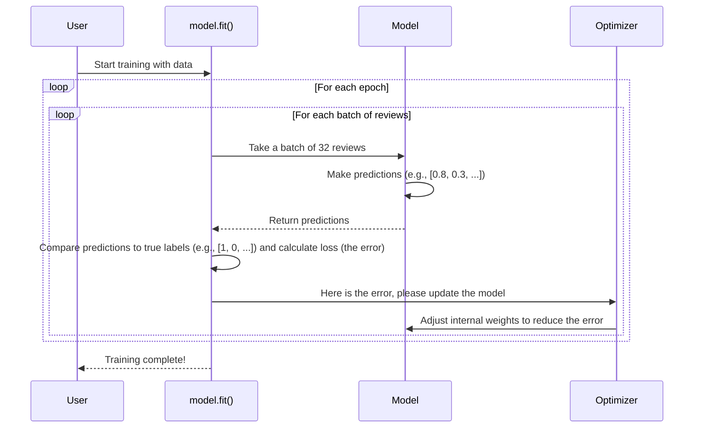

# Chapter 5: Model Training Pipeline

In [Chapter 4: RNN Sentiment Analysis Model](04_rnn_sentiment_analysis_model.md), we successfully designed the architecture for our sentiment analysis model. We built an "empty brain" with all the right connections—an `Embedding` layer, an `RNN` layer, and a `Dense` layer. However, this brain is completely untrained. It has no idea what "good" or "bad" means.

This is where the training process comes in. Think of it like teaching a student. You can't just hand them a textbook and expect them to learn. You need a structured lesson plan:
1.  **Set the Rules:** How will the student be graded? (Loss Function) How will they learn from their mistakes? (Optimizer) What subjects will be on their report card? (Metrics)
2.  **Start the Lessons:** The student studies the textbook and examples, one chapter at a time. (Fitting the model on data)
3.  **Give Quizzes:** Periodically check their progress on practice questions they haven't seen before. (Validation)
4.  **Graduate:** Once the student has learned enough, they get a diploma, certifying their knowledge. (Saving the trained model)

This entire end-to-end process is our **Model Training Pipeline**. In this chapter, we'll walk through exactly how we take our empty model, teach it using the IMDB dataset, and save its newfound knowledge.

### Step 1: Compiling the Model (Setting the Rules)

Before we can start training, we need to configure the learning process. This is done with the `model.compile()` method. It's like giving our student their syllabus and grading rubric.

We need to specify three key things:

```python
model.compile(optimizer='adam',
              loss='binary_crossentropy',
              metrics=['accuracy'])
```

Let's break down this command from `simple-rnn.ipynb`:

*   `optimizer='adam'`: This is the **teacher**. The optimizer's job is to adjust the model's internal parameters (its "knowledge") to reduce mistakes. `'adam'` is a very popular and effective optimizer that works well for most problems. It's like an experienced teacher who knows how to guide the student effectively.
*   `loss='binary_crossentropy'`: This is the **grading system**. The loss function calculates a score that tells us how wrong the model's prediction was. Since our task is to classify reviews into two categories (positive/negative), `binary_crossentropy` is the perfect choice. A high loss score means a big mistake; a low loss score means the model is close to the correct answer.
*   `metrics=['accuracy']`: This is the **report card**. While the loss score is used for training, it's not very human-friendly. We want to see a metric we can easily understand, like accuracy. `accuracy` simply tells us the percentage of reviews the model classified correctly.

With our model compiled, it's now ready for class!

### Step 2: Training the Model (The Classroom Session)

Now for the most exciting part: the actual learning! We use the `model.fit()` method to train our model on the 25,000 reviews in our training set. This is where the model will read thousands of reviews and slowly learn the patterns that distinguish positive sentiment from negative.

```python
# Train the model on the training data
model.fit(X_train, y_train,
          epochs=2,
          batch_size=32,
          validation_split=0.2)
```

This single line kicks off the entire training process. Let's look at the arguments:
*   `X_train, y_train`: This is the textbook and the answer key. `X_train` contains the movie reviews (the questions), and `y_train` contains the correct labels (0 for negative, 1 for positive).
*   `epochs=2`: An epoch is one complete pass through the entire training dataset. By setting `epochs=2`, we're telling the model to read all 25,000 reviews two times. Repetition helps reinforce learning.
*   `batch_size=32`: The model doesn't learn from one review at a time. It studies them in small groups or "batches". Here, it will look at 32 reviews, make predictions, calculate its mistakes, and update its knowledge before moving to the next batch of 32.
*   `validation_split=0.2`: This is a clever trick. We tell Keras to set aside 20% of our training data to be used as a "quiz" after each epoch. The model doesn't *learn* from this validation data; it only uses it to check its progress on data it hasn't seen during the lesson. This helps us see if the model is truly learning or just memorizing the answers.

When you run this code, you'll see a progress bar and some logs:

```
Epoch 1/2
625/625 [==============================] - 88s 140ms/step - loss: 0.6544 - accuracy: 0.6214 - val_loss: 0.6285 - val_accuracy: 0.6256
Epoch 2/2
625/625 [==============================] - 71s 114ms/step - loss: 0.5112 - accuracy: 0.7208 - val_loss: 0.6444 - val_accuracy: 0.5928
```
*   `loss` and `accuracy`: The model's grade on the training data it's learning from.
*   `val_loss` and `val_accuracy`: The model's grade on the 20% "quiz" data. This is often a more honest measure of how well the model is learning.

### Step 3: Saving the Trained Model (Graduation Day)

After a few epochs, our model has finished its training. It has learned a lot about the patterns of positive and negative language in movie reviews. But if we close our program, all that knowledge will be lost!

We need to save our newly-trained "brain" to a file so we can use it later for making predictions, without having to retrain it every time.

```python
# Save the model's learned weights to a file
model.save('simple_rnn_imdb.h5')
```

This one command takes all the learned parameters—the knowledge inside the `Embedding`, `SimpleRNN`, and `Dense` layers—and saves them into a single file named `simple_rnn_imdb.h5`. This file is our final, valuable product from the training pipeline. We'll explore this file more in the next chapter.

### Under the Hood: The Training Loop

What is `model.fit()` actually doing? It's running a loop. For each epoch, it loops through the entire dataset in small batches. Here’s what happens for a single batch:



1.  **Forward Pass**: The model takes a batch of reviews and makes a prediction for each one.
2.  **Loss Calculation**: `model.fit()` compares these predictions to the true labels and calculates the loss (how wrong the model was).
3.  **Backward Pass (Backpropagation)**: The `optimizer` uses the loss score to figure out how to adjust each and every one of the model's 1.3 million parameters. It nudges them in a direction that would have made the loss smaller.
4.  **Repeat**: This process repeats for every batch, over and over, until the model has seen all the data for the specified number of epochs. With each step, the model gets a little bit smarter.

### Conclusion

We've now seen the entire journey from an empty model to a trained one. The model training pipeline is the engine that drives the learning process. You've learned:

1.  **How to Compile a model**: Setting up the `optimizer`, `loss` function, and `metrics` to define the rules of learning.
2.  **How to Fit a model**: Using `model.fit()` to train the model on data, and what `epochs` and `batch_size` mean.
3.  **How to Save a model**: Storing the trained model's knowledge into a single file for later use.

We have successfully created our trained model and saved it as `simple_rnn_imdb.h5`. This file is the "diploma"—a tangible artifact that holds all the intelligence we've built. What is this file exactly, and what's inside it? Let's find out.

Next: [Chapter 6: Trained Model Artifact](06_trained_model_artifact.md)

---

Generated by [AI Codebase Knowledge Builder](https://github.com/The-Pocket/Tutorial-Codebase-Knowledge)