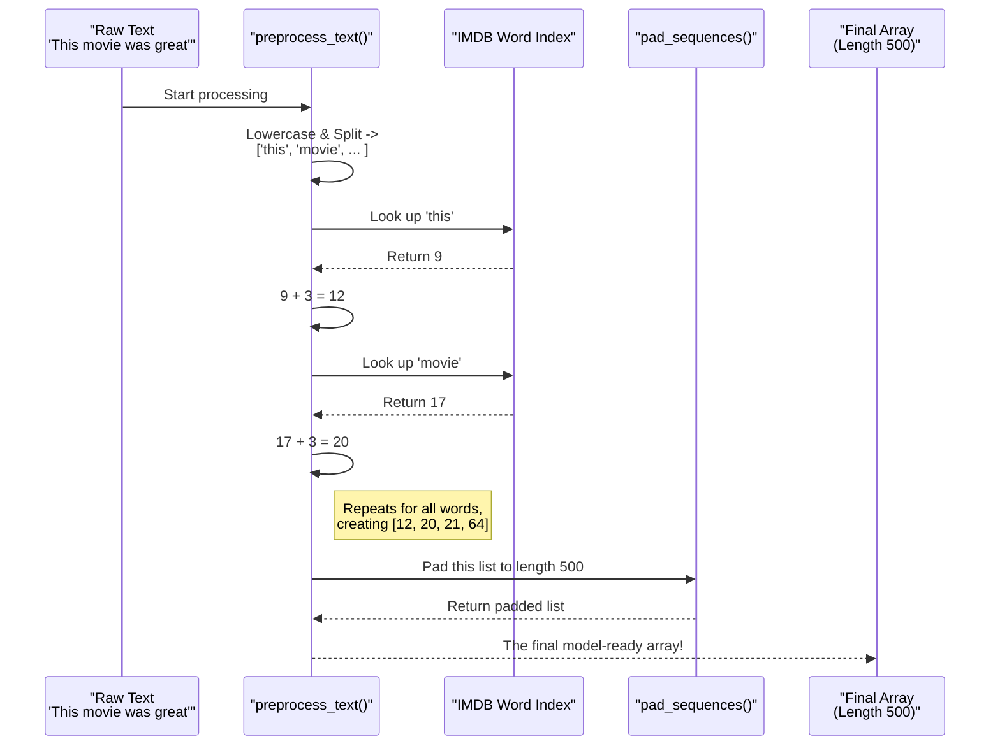

# Chapter 6: The All-in-One Text Preparer (`preprocess_text`)

In the [previous chapter on the IMDB Word Index](05_imdbwordindex.md), we found our "official codebook." We now have the exact word-to-number dictionary that our pre-trained model understands. We also know from previous chapters that we need to pad our sentences to a fixed length.

So, what's the next step? We need to combine all these ideas into a single, efficient function. When a user types a movie review into our app, we need one machine that can take their raw text and perform all the necessary transformations in the correct order.

This is exactly what the `preprocess_text` function does. It’s our complete text-to-numbers assembly line.

### The Goal: From Raw Text to Model-Ready Numbers

Let's imagine our use case. A user types the following review into our app's text box:
`"This movie was great"`

Our model can't understand this. It needs a very specific input: a list of numbers that is exactly 500 items long. The `preprocess_text` function is designed to handle this entire conversion.

**Input:** `"This movie was great"`
**Output:** A numerical array like `[0, 0, 0, ..., 12, 17, 21, 64]` (with a total length of 500)

Let's break down how this function achieves this transformation step-by-step.

### The Code in Action: A Step-by-Step Breakdown

Here is the complete `preprocess_text` function from our `main.py` file. It might look a little complex at first, but it's just a sequence of three simple steps we've already learned about.

```python
# Function to preprocess user input
def preprocess_text(text):
    # Step 1: Tokenize the text
    words = text.lower().split()
    
    # Step 2: Convert words to integers using the word_index
    encoded_review = [word_index.get(word, 2) + 3 for word in words]
    
    # Step 3: Pad the sequence to a length of 500
    padded_review = sequence.pad_sequences([encoded_review], maxlen=500)
    
    return padded_review
```
Let's walk through this with our example input: `"This movie was great"`.

#### Step 1: Tokenization

The first step is to break the sentence into a list of individual words, also known as **tokens**. We also convert everything to lowercase to ensure consistency (so "Movie" and "movie" are treated as the same word).

```python
text = "This movie was great"
words = text.lower().split()
print(words)
```
**Output:**
```
['this', 'movie', 'was', 'great']
```
*   `.lower()`: This method converts the entire string to lowercase.
*   `.split()`: This method splits the string into a list of words, using spaces as the separator.

#### Step 2: Integer Encoding

Now that we have a list of words, we need to convert each word into its official number using the `word_index` we loaded in the previous chapter.

```python
# This is a "list comprehension" - a compact way to build a list.
encoded_review = [word_index.get(word, 2) + 3 for word in words]
print(encoded_review)
```
**Output:**
```
[12, 20, 21, 64] # Note: These numbers are examples (17+3=20 for movie)
```
This single line of code is very powerful. Let's break it down:
*   `for word in words`: It loops through our list `['this', 'movie', 'was', 'great']`.
*   `word_index.get(word, 2)`: For each word, it looks it up in our dictionary. If a word isn't found (e.g., a typo), it safely returns `2`, our ID for "Unknown" words.
*   `+ 3`: It adds the crucial index offset we learned about, shifting every ID up by 3 to make room for the special tokens (Padding, Start, Unknown).

#### Step 3: Sequence Padding

We now have a list of numbers, but our model expects a list that is exactly **500** numbers long. The final step is to pad it.

```python
# Note: We put [encoded_review] in another list because pad_sequences expects a list of sentences.
padded_review = sequence.pad_sequences([encoded_review], maxlen=500)
```
This is the `pad_sequences` function we mastered in the [SequencePadding](03_sequencepadding.md) chapter. It takes our list `[12, 20, 21, 64]` and adds 496 zeros to the beginning, resulting in a final list that is 500 items long. This is the final, model-ready format!

### How It Works: The Assembly Line

We can visualize the entire `preprocess_text` function as an assembly line that processes raw text.



This function is the bridge that connects the human world (text) to the computer world (numbers). Every time a user clicks the "Classify" button in our app, this function is called to prepare their input for the model.

```python
# A snippet from main.py showing how it's used
if st.button('Classify'):
    # Here's our function in action!
    preprocessed_input = preprocess_text(user_input)

    # The result is then sent to the model for prediction
    prediction = model.predict(preprocessed_input)
    # ... display the result ...
```

### Conclusion

Fantastic! You have now seen how all the individual concepts—integer encoding, the official word index, and sequence padding—come together in a single, reusable function called `preprocess_text`.

You've learned:
*   The three key steps of text preparation: **tokenize**, **encode**, and **pad**.
*   How the `preprocess_text` function implements these steps in the correct order.
*   That this function is the critical link between user input and the model's prediction.

We've successfully converted a review from words to numbers. But what if we want to go the other way? Our model works with numbers, but it would be cool to see what those numbers mean in plain English. How can we decode a numerical review back into words?

That's exactly what we'll explore in the next chapter. Let's learn how to build our "decoder ring" in [Chapter 7: decode_review](07_decode_review.md).

---

Generated by [AI Codebase Knowledge Builder](https://github.com/The-Pocket/Tutorial-Codebase-Knowledge)