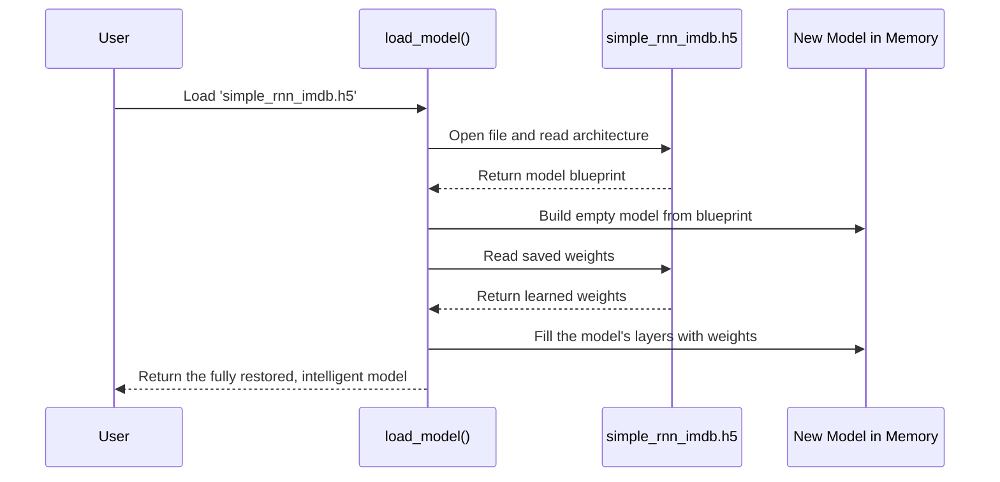

# Chapter 6: Trained Model Artifact

In [Chapter 5: Model Training Pipeline](05_model_training_pipeline.md), we put our model through a rigorous "schooling" session. It studied thousands of movie reviews, learned from its mistakes, and finally "graduated" with the knowledge of how to spot positive and negative sentiment. At the end of that chapter, we saved all of its hard-earned knowledge into a single file: `simple_rnn_imdb.h5`.

But what exactly *is* this file? And how does it save us from having to retrain our model every time we want to use it?

Think of it this way: the training process was like a student spending years in medical school. The `simple_rnn_imdb.h5` file is their final medical degree and license. They don't need to go back to school every time a new patient comes in. They can just present their license, which proves they have the knowledge, and get straight to work. This file is our model's "license to predict."

### The Goal: A Reusable Brain

Our goal is to be able to use our model's intelligence without re-running the slow and expensive training process. We want to load its "brain" from a file and start making predictions immediately. This file, `simple_rnn_imdb.h5`, is called a **model artifact**. It's the tangible, final product of our training pipeline.

### What's Inside the `simple_rnn_imdb.h5` File?

This file is not a simple text file you can open and read. It's a specially formatted binary file (using a standard called HDF5) that neatly packages two critical things:

1.  **The Model's Architecture (The Blueprint):** The file contains a complete blueprint of our model. It remembers that we have an `Embedding` layer, followed by a `SimpleRNN` layer, followed by a `Dense` layer. It knows the exact settings for each one, like the vocabulary size and the number of memory units.
2.  **The Model's Weights (The Knowledge):** This is the most important part! It stores the millions of tiny numerical values, called **weights**, that the model learned during training. These weights are the essence of its knowledge. They are the fine-tuned parameters that allow the model to distinguish a positive review from a negative one.

So, the `.h5` file is like a "brain in a box." It has both the structure of the brain and all the memories and knowledge stored within it.

### Step 1: Loading the Brain from the Box

The most powerful thing about this artifact is how easy it is to use. With a single Keras command, we can load the entire model—architecture and weights—back into our program.

This is exactly what we do in our `prdictions.ipynb` notebook and our `main.py` Streamlit application script.

```python
from tensorflow.keras.models import load_model

# This one line rebuilds the model and restores its knowledge!
model = load_model('simple_rnn_imdb.h5')
```

That's it! After running this command, the `model` variable holds a fully functional, intelligent model, ready to make predictions. We didn't have to define the layers or run `model.fit()` again. It's all been restored from the file.

### Step 2: Verifying the Loaded Model

How can we be sure it worked? We can print the model's summary again, just like we did back in [Chapter 4: RNN Sentiment Analysis Model](04_rnn_sentiment_analysis_model.md).

```python
model.summary()
```

The output will be identical to the one we saw before training:
```
Model: "sequential"
_________________________________________________________________
 Layer (type)                Output Shape              Param #   
=================================================================
 embedding (Embedding)       (None, 500, 128)          1280000   
                                                                 
 simple_rnn (SimpleRNN)      (None, 128)               32896     
                                                                 
 dense (Dense)               (None, 1)                 129       
                                                                 
=================================================================
Total params: 1,313,025
Trainable params: 1,313,025
Non-trainable params: 0
_________________________________________________________________
```
This confirms that Keras has successfully rebuilt the model's architecture from the information stored in the `.h5` file. And hidden from view, all 1,313,025 of its parameters (weights) have been loaded with the values they learned during training.

### Under the Hood: The `load_model` Process

What magic happens when you call `load_model()`? It's a very organized, two-step process.

1.  **Read the Blueprint:** Keras opens the `simple_rnn_imdb.h5` file and first looks for the architecture information. It reads this "blueprint" and constructs a brand new, empty model in memory with the exact same layers and connections as our original.
2.  **Inject the Knowledge:** Next, Keras reads the weights for each layer from the file. It then carefully injects these saved weights into the corresponding places in the newly created empty model.

Let's visualize this:


This process of saving and loading models is fundamental to machine learning. It separates the time-consuming training phase from the fast prediction (or "inference") phase.

### Conclusion

In this chapter, we've uncovered the importance of the trained model artifact. We learned that:

1.  A **model artifact** (`simple_rnn_imdb.h5`) is a file that stores both the model's architecture (its structure) and its learned weights (its knowledge).
2.  It allows us to **reuse** our model's intelligence without needing to retrain it every time.
3.  The `load_model()` function in Keras makes it incredibly simple to restore a trained model and have it ready for making predictions in seconds.

We now have our trained, intelligent model loaded and ready to go. But there's one last problem to solve. Our model was trained on perfectly prepared, numerical data. How do we take a new movie review, typed in by a user as plain text, and convert it into the exact numerical format our model expects?

That is the job of our next helper function, `preprocess_text`.

Next: [Chapter 7: preprocess_text](07_preprocess_text.md)

---

Generated by [AI Codebase Knowledge Builder](https://github.com/The-Pocket/Tutorial-Codebase-Knowledge)