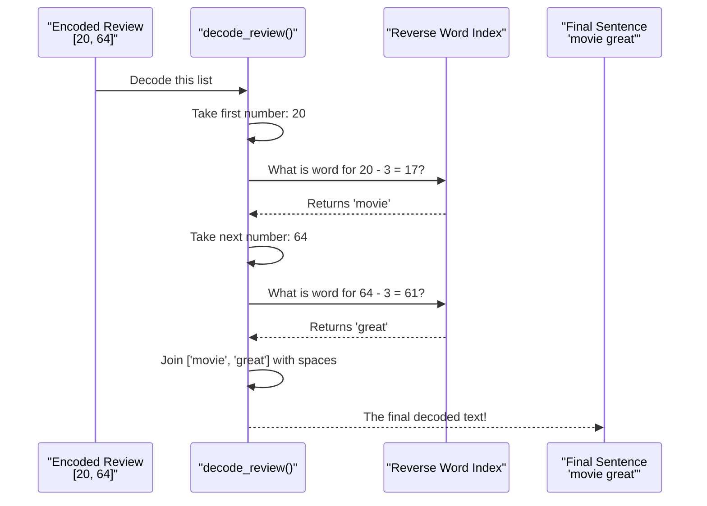

# Chapter 7: The Decoder Ring (`decode_review`)

In the [previous chapter on `preprocess_text`](06_preprocess_text.md), we built our "assembly line" to turn human-readable text into model-ready numbers. We mastered the art of going from words to code. But what if we want to go the other way? What if we have a sequence of numbers and want to translate it back into plain English?

### The Problem: Translating Code Back to Words

Imagine you've loaded a movie review from the original IMDB dataset. It looks something like this:
`[1, 14, 22, 16, 43, 530, ...]`

This is meaningless to a human. Is it a good review? A bad one? We have no idea! To understand our data, debug our model, or just satisfy our curiosity, we need a way to decode these numbers back into words. This is where our "decoder ring" function, `decode_review`, comes in. It reverses the process, turning the model's language back into human language.

### The Key Idea: A Reverse Dictionary

Our `IMDBWordIndex` is like a dictionary where you look up a word to find its corresponding number.

*   `word_index['movie']` gives you `17`.

To decode, we need the opposite: a dictionary where we can look up a number to find its corresponding word.

*   We want to look up `17` and get back `'movie'`.

**Analogy:** It's like having a phonebook sorted by name, but needing to find a name by looking up a phone number. We need to create a "reverse phonebook" for our words.

### The Code in Action: Creating the `reverse_word_index`

Thankfully, Python makes creating this reverse dictionary incredibly easy. We can do it in a single line of code right after we load the original index.

```python
# The original word_index maps words to numbers
word_index = imdb.get_word_index()

# We flip the keys and values to create our reverse index
reverse_word_index = {value: key for key, value in word_index.items()}
```
This elegant bit of code, called a dictionary comprehension, goes through every `(key, value)` pair in our original `word_index` and creates a new dictionary with the `value` as the new key and the `key` as the new value.

Now, we can perform a reverse lookup!

```python
# What word corresponds to the number 17?
print(reverse_word_index.get(17))
```
**Output:**
```
movie
```
Perfect! We now have our decoder ring.

### The `decode_review` Function: Putting It All Together

With our `reverse_word_index` ready, we can build the full decoding function. Here it is from our `main.py` file:

```python
# Function to decode reviews from numbers back to words
def decode_review(encoded_review):
    # Perform the lookup, remembering to subtract the offset of 3!
    words = [reverse_word_index.get(i - 3, '?') for i in encoded_review]
    
    # Join the words back into a single string
    return ' '.join(words)
```
This function looks simple, but it handles a very important detail. Let's break it down using an example encoded review `[20, 64]`.

1.  **Looping and Subtracting:** The code loops through each number `i` in the `encoded_review`. The most critical part is `i - 3`. Remember how we **added 3** to every index in the [preprocess_text](06_preprocess_text.md) function to avoid the special reserved spots (0, 1, 2)? To find the original word in our `reverse_word_index`, we must now **subtract** that 3 back.
    *   For the number `20`, we look up `20 - 3 = 17`.
    *   For the number `64`, we look up `64 - 3 = 61`.

2.  **Safe Lookup:** The `.get(..., '?')` method is used for a safe lookup. If we encounter a number that doesn't have a corresponding word in our dictionary (maybe it's a padding `0` or an unknown word token), it won't crash. Instead, it will simply return a `'?'`. This makes our output readable even if there are gaps.

3.  **Joining the Words:** After the loop finishes, we'll have a list of words, like `['movie', 'great']`. The `' '.join(...)` method takes all the words in the list and stitches them together into a single sentence, separated by spaces.

### How It Works: The Decoding Process

Let's visualize the `decode_review` function as a reverse assembly line.



This function is the perfect counterpart to our `preprocess_text` function. One encodes, the other decodes, allowing us to move freely between the human and machine worlds.

### Conclusion

Great job! You've now learned how to reverse the text preparation process. While this `decode_review` function isn't needed for the final prediction in the app, it's an essential tool for any developer working with text data.

You've learned:
*   **Why** we need to decode numerical sequences back into text.
*   **How** to create a "reverse word index" to map numbers back to words.
*   The step-by-step logic of the `decode_review` function, including the crucial step of **subtracting the index offset**.

We now have a complete understanding of how to prepare our text data and inspect it. We are finally ready to build the brain of our operation: the neural network model that will actually learn to predict sentiment.

Let's dive in and build our [SentimentPredictionModel](08_sentimentpredictionmodel.md).

---

Generated by [AI Codebase Knowledge Builder](https://github.com/The-Pocket/Tutorial-Codebase-Knowledge)