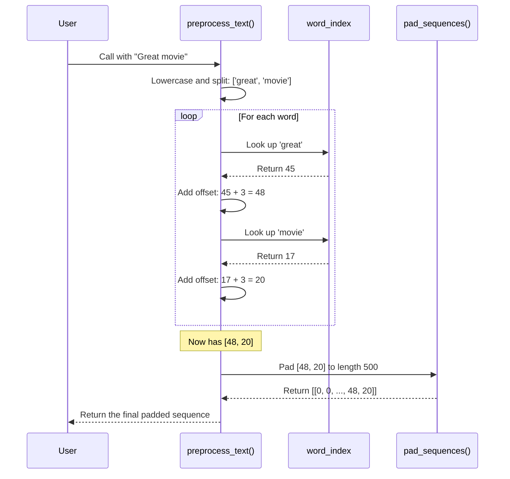

# Chapter 7: preprocess_text

In [Chapter 6: Trained Model Artifact](06_trained_model_artifact.md), we learned how to load our trained model's "brain" from the `simple_rnn_imdb.h5` file. Our model is now loaded and ready, but there's a catch. It's like a brilliant mathematician who only understands the language of numbers.

If you ask a user for a movie review, they will type something like:
`"This movie was absolutely brilliant!"`

But our model was trained on data that looks like this:
`[0, 0, 0, ..., 43, 22, 16, 123, 789]`

How do we bridge this gap? We need a translator that can take the user's plain English and convert it into the exact numerical format our model expects. This translator is our `preprocess_text` function.

### The Goal: A Universal Translator for Our Model

Our goal is to build a helper function that takes any raw text string and performs a three-step translation process to make it "model-ready":

1.  **Tokenize**: Break the text into a list of words.
2.  **Encode**: Convert each word into its unique number ID.
3.  **Pad**: Make the list of numbers exactly 500 items long.

This function is the essential front door for our model. Any new data must pass through it before it can be understood.

### Step 1: Breaking Down the Text (Tokenization)

First, we need to take a sentence and split it into individual words, which are called "tokens." We also want to make sure everything is in lowercase, so that "The" and "the" are treated as the same word, just like they were in the training data.

Python makes this step very easy.

```python
text = "This movie was absolutely brilliant!"

# Convert to lowercase and split into words
words = text.lower().split()

print(words)
```
**Output:**
```
['this', 'movie', 'was', 'absolutely', 'brilliant!']
```
Simple! We now have a list of word tokens.

### Step 2: Turning Words into Numbers (Encoding)

Next, we need to convert each word in our list into its corresponding number from the IMDB vocabulary. In [Chapter 2: decode_review](02_decode_review.md), we used a `word_index` to look up words for numbers. Now, we'll use it the other way around.

We'll load the same `word_index` provided by Keras.

```python
from tensorflow.keras.datasets import imdb

# The word_index is a dictionary mapping words to integers
word_index = imdb.get_word_index()

# Example: word_index['movie'] would give us 17
```

We can now loop through our list of `words` and look each one up in the `word_index`. But there are two important details:

1.  **What if a word isn't in our dictionary?** A user might type a word our model has never seen. We need to handle this gracefully. The IMDB dataset reserves the number `2` for "unknown" words. So, if a word is not found, we'll assign it the number `2`.
2.  **The 3-Index Offset:** Remember from Chapter 2, the `word_index` values are offset by 3. For example, the word "the" has an index of `1`, but in the actual data, it's represented as `4`. This is because indices 0, 1, and 2 are reserved. We must add `3` to every index we look up.

Here is how we can do this for our list of words:

```python
# Convert words to their integer codes
# .get(word, 2) returns the index for the word, or 2 if it's not found
encoded_review = [word_index.get(word, 2) + 3 for word in words]

print(encoded_review)
```
**Output (example numbers):**
```
[14, 17, 16, 350, 488]
```
Now our review is a list of numbers, just like our training data! We are one step away.

### Step 3: Making It the Right Size (Padding)

Our RNN model is very strict. It was trained on reviews that were all exactly `500` numbers long. Any new review we give it must also be exactly `500` numbers long.

We'll use the same `pad_sequences` function we saw in [Chapter 1: IMDB Dataset Loading and Preparation](01_imdb_dataset_loading_and_preparation.md) to add zeros to the beginning of our sequence until it reaches the desired length.

```python
from tensorflow.keras.preprocessing import sequence

# Pad the sequence to a length of 500
padded_review = sequence.pad_sequences([encoded_review], maxlen=500)

print(padded_review)
```
**Output:**
```
[[  0   0   0 ... 16  350  488]]
```
Notice the `[[...]]`. The extra pair of brackets is because `pad_sequences` and our model are designed to work with batches of reviews, so it formats the output as a list containing our single review. This `(1, 500)` shape is the exact format our model needs!

### The Complete `preprocess_text` Function

Now let's combine these three steps into a single, reusable function. This exact function can be found in `main.py` and `prdictions.ipynb`.

```python
def preprocess_text(text):
    # 1. Tokenize
    words = text.lower().split()
    
    # 2. Encode
    encoded_review = [word_index.get(word, 2) + 3 for word in words]
    
    # 3. Pad
    padded_review = sequence.pad_sequences([encoded_review], maxlen=500)
    
    return padded_review
```
This clean, simple function takes care of the entire translation process.

### Under the Hood: The Preprocessing Pipeline

Let's visualize the journey of a user's text as it goes through our function.



This pipeline ensures that no matter what text a user enters, it is transformed into a standardized format that our model can reliably process.

### Conclusion

In this chapter, we built the final bridge connecting our application to our model. We learned:

1.  The three crucial steps for preparing new text data: **Tokenization**, **Encoding**, and **Padding**.
2.  How to use the `word_index` to convert words to numbers, handling unknown words and the index offset.
3.  How to assemble these steps into a single, powerful `preprocess_text` function.

We now have all the individual pieces we need:
*   A loaded, trained model ready to predict ([Chapter 6](06_trained_model_artifact.md)).
*   A pre-processing function to prepare user input (`preprocess_text`).

It's time to put them together! In the next chapter, we will create one last helper function, `predict_sentiment`, which will use our model and our preprocessor to give a user a final, human-readable sentiment prediction.

Next: [Chapter 8: predict_sentiment](08_predict_sentiment.md)

---

Generated by [AI Codebase Knowledge Builder](https://github.com/The-Pocket/Tutorial-Codebase-Knowledge)