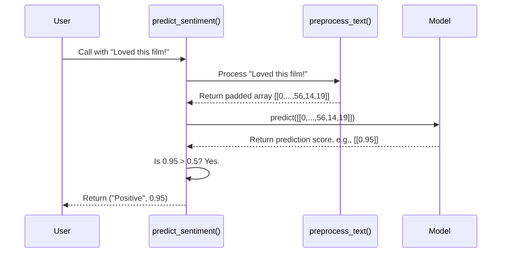

# Chapter 8: predict_sentiment

In [Chapter 7: preprocess_text](07_preprocess_text.md), we built a fantastic "translator" function. This `preprocess_text` function takes any movie review written in plain English and converts it into the perfect numerical format that our model can understand.

We now have our two star players on the field:
1.  **The Brain**: Our trained model, loaded from the `simple_rnn_imdb.h5` file, which knows how to analyze sentiment from numbers.
2.  **The Translator**: Our `preprocess_text` function, which converts words into the numbers our model needs.

But right now, they are separate. To make a prediction, we would have to manually call the translator first, and then feed its output to the brain. This is clumsy. What we really want is a single "manager" who handles the entire process for us. This manager is our `predict_sentiment` function.

### The Goal: One Function to Rule Them All

Our goal is to create one simple, elegant function that hides all the complexity. We want to be able to give it a raw text review, and in return, get a simple, human-readable answer like "Positive" along with the model's confidence score.

Think of it like ordering a pizza. You don't tell the chef to first get the dough, then add the sauce, then the cheese. You just say "I'd like a pepperoni pizza." The `predict_sentiment` function is our "pizza order"—it handles all the steps behind the scenes.

### Step 1: Combining the Pieces

The `predict_sentiment` function, found in `prdictions.ipynb`, is essentially a short, three-step recipe that uses the components we've already built.

Let's look at the complete function first, and then we'll break it down piece by piece.

```python
def predict_sentiment(review):
    # Step 1: Translate the review into numbers
    preprocessed_input = preprocess_text(review)

    # Step 2: Ask the model for its opinion
    prediction = model.predict(preprocessed_input)

    # Step 3: Interpret the model's answer
    sentiment = 'Positive' if prediction[0][0] > 0.5 else 'Negative'
    
    # Return the final, friendly result
    return sentiment, prediction[0][0]
```

This function is beautiful in its simplicity! Let's examine each step.

#### Step 1: Preprocessing the Input

```python
preprocessed_input = preprocess_text(review)
```
First, the function takes the user's `review` (e.g., "The movie was terrible") and immediately passes it to our translator, the `preprocess_text` function from the last chapter. This returns the perfectly formatted, padded, numerical array that our model is expecting.

#### Step 2: Getting the Model's Prediction

```python
prediction = model.predict(preprocessed_input)
```
Next, it takes the `preprocessed_input` and hands it over to our trained model. The `model.predict()` method does the heavy lifting: it runs the numerical data through the `Embedding`, `RNN`, and `Dense` layers to produce a final score. This score will be a number between 0 and 1.

#### Step 3: Interpreting the Score

```python
sentiment = 'Positive' if prediction[0][0] > 0.5 else 'Negative'
```
The model's output, `prediction`, is a raw number like `0.98` or `0.12`. This isn't very user-friendly! This final step translates that number into a simple word. We use a simple rule:
*   If the score is **greater than 0.5**, we'll call it a "Positive" review.
*   If the score is **0.5 or less**, we'll call it a "Negative" review.

The `prediction[0][0]` is just how we access the single number inside the model's output array.

### Let's Try It Out!

Now, we can use our all-in-one function to analyze a new review.

```python
# A new, positive review
example_review = "This movie was fantastic! The acting was great and the plot was thrilling."

# Call our manager function
sentiment, score = predict_sentiment(example_review)

# Print the easy-to-read results
print(f"Review: {example_review}")
print(f"Sentiment: {sentiment}")
print(f"Prediction Score: {score}")
```
**Output:**
```
Review: This movie was fantastic! The acting was great and the plot was thrilling.
Sentiment: Positive
Prediction Score: 0.9876543
```
(Note: Your exact score may vary slightly, but it should be high for this review.)

It worked perfectly! We gave it a sentence, and it gave us back a clear sentiment and the confidence score. We have successfully encapsulated our entire prediction process.

### Under the Hood: The Prediction Assembly Line

When we call `predict_sentiment`, it kicks off a clean, step-by-step assembly line. Let's visualize the journey of a review.


This diagram shows how `predict_sentiment` acts as a coordinator, passing the data from one stage to the next, and finally converting the raw output into something meaningful for the user.

### Conclusion

In this chapter, we've reached a major milestone. We've taken all the individual components we've built over the last several chapters and wrapped them up into a single, powerful, and easy-to-use function.

You've learned:
1.  **Encapsulation**: The principle of hiding complex logic inside a simple function.
2.  **The Prediction Pipeline**: The complete flow from raw text to a final, human-readable sentiment.
3.  **Interpreting Model Output**: How to convert a raw prediction score (like `0.98`) into a meaningful classification (like "Positive").

Our core logic is now complete. We have a function that can analyze the sentiment of any movie review we give it. But how can we share this with the world? Running code in a notebook is great for developers, but not for everyday users.

In the next chapter, we'll take our `predict_sentiment` function and build a simple, interactive web application around it using Streamlit. It's time to bring our model to life!

Next: [Chapter 9: Sentiment Analysis Streamlit Application](09_sentiment_analysis_streamlit_application.md)

---

Generated by [AI Codebase Knowledge Builder](https://github.com/The-Pocket/Tutorial-Codebase-Knowledge)