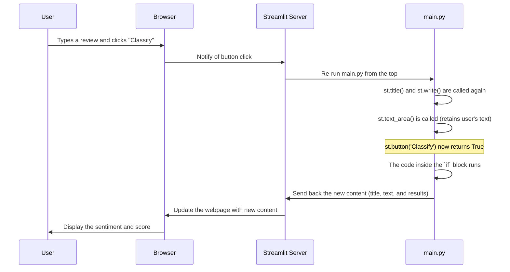

# Chapter 9: Sentiment Analysis Streamlit Application

In [Chapter 8: predict_sentiment](08_predict_sentiment.md), we reached a huge milestone by creating a single, powerful function that could take a raw movie review and give us back a clear, human-readable sentiment. Our project's core logic is complete!

But there's one final step. Right now, our amazing sentiment predictor lives inside a code file or a Jupyter notebook. If you wanted to show it to a friend, you'd have to ask them to install Python, run your script, and see the output in a terminal. That's not very user-friendly!

How can we turn our Python code into something anyone can use, just by opening a webpage? This is where **Streamlit** comes to the rescue. In this chapter, we'll build a simple, interactive web application that provides a beautiful user interface for our model.

### The Goal: A Web App for Everyone

Our goal is to create a webpage where a user can:
1.  See a title and some instructions.
2.  Type a movie review into a text box.
3.  Click a button that says "Classify".
4.  Instantly see the predicted sentiment ("Positive" or "Negative") and the model's confidence score right on the page.

We will do all of this in a single Python file (`main.py`) without writing a single line of HTML, CSS, or JavaScript!

### What is Streamlit?

Streamlit is a free, open-source Python library that lets you create and share beautiful, custom web apps for machine learning and data science in minutes. Think of it as a magic wand that turns your data scripts into interactive applications.

If you can write Python, you can build a Streamlit app. It's that simple.

### Step 1: Setting the Stage (Imports and Loading)

Our Streamlit application will be built in the `main.py` script. The first part of this script is stuff we've already seen: importing our libraries and loading our trained model and word index.

```python
# main.py
import streamlit as st
import tensorflow as tf
from tensorflow.keras.models import load_model
# ... other necessary imports and functions ...

# Load the pre-trained model
model = load_model('simple_rnn_imdb.h5')

# ... helper functions like preprocess_text are also in this file ...
```
The new and most important line here is `import streamlit as st`. This gives us access to all of Streamlit's magical commands.

### Step 2: Adding a Title and Text

Creating elements on our webpage is as easy as calling a function. Let's give our app a title and a short description.

```python
# main.py
st.title('IMDB Movie Review Sentiment Analysis')
st.write('Enter a movie review to classify it as positive or negative.')
```
*   `st.title()`: This command will display a large, bold title on our web app.
*   `st.write()`: This is a general-purpose command that can display text, numbers, dataframes, and more.

Just these two lines of code create the header for our application!

### Step 3: Getting User Input

Next, we need a place for the user to type their review. For this, Streamlit provides a `text_area` widget.

```python
# main.py
user_input = st.text_area('Movie Review')
```
This single line creates a beautiful multi-line text box on the webpage with the label "Movie Review". Whatever the user types into this box will be stored in the `user_input` variable in our Python script.

### Step 4: Adding a Button and Prediction Logic

The magic happens when the user clicks a button. We can create a button and make our prediction logic run *only* when that button is pressed.

```python
# main.py
if st.button('Classify'):
    # This code runs ONLY when the button is clicked
    
    # 1. Preprocess the user's input using our helper function
    preprocessed_input = preprocess_text(user_input)

    # 2. Get the model's prediction
    prediction = model.predict(preprocessed_input)
    sentiment = 'Positive' if prediction[0][0] > 0.5 else 'Negative'

    # 3. Display the results
    st.write(f'Sentiment: {sentiment}')
    st.write(f'Prediction Score: {prediction[0][0]}')
```
This is the heart of our app:
*   `st.button('Classify')`: This creates a button labeled "Classify". It also acts like an `if` statement: the code inside the block will only execute when the button is clicked.
*   Inside the `if` block, we use the tools we built in previous chapters: we call [preprocess_text](07_preprocess_text.md) on the `user_input`, feed the result to our [Trained Model Artifact](06_trained_model_artifact.md), and interpret the score.
*   Finally, we use `st.write()` again to show the final sentiment and score to the user.

### How to Run Your Application

With the `main.py` script saved, running your web app is a single command in your terminal:

```bash
streamlit run main.py
```

After you run this, Streamlit will start a local web server and automatically open a new tab in your browser. You will see your live, interactive application!


### Under the Hood: How Does Streamlit Work?

Streamlit's magic comes from a simple but powerful idea: whenever you interact with a widget (like clicking a button or typing in a text box), Streamlit **re-runs your entire Python script from top to bottom**.

Let's see what happens when a user clicks the "Classify" button.



This simple execution model is what makes Streamlit so easy to learn. You don't have to think about complex states or callbacks; you just write a script that flows from top to bottom.

### Conclusion

Congratulations! You have officially built a complete, end-to-end machine learning application. You've gone from raw data to a fully trained model, and now you've wrapped it in a beautiful, interactive web application that anyone can use.

In this chapter, you learned:
1.  **What Streamlit is**: An easy way to turn Python scripts into web apps.
2.  **How to use basic Streamlit commands**: `st.title`, `st.write`, `st.text_area`, and `st.button`.
3.  **How to structure a Streamlit app**: Combining input widgets with logic to create an interactive experience.
4.  **How to run your application**: Using the simple `streamlit run` command.

Our journey is almost complete. The final chapter will provide a bonus notebook that lets you play around with the model and inspect its predictions in more detail, solidifying everything you've learned.

Next: [Chapter 10: Prediction and Model Inspection Notebook](10_prediction_and_model_inspection_notebook.md)

---

Generated by [AI Codebase Knowledge Builder](https://github.com/The-Pocket/Tutorial-Codebase-Knowledge)