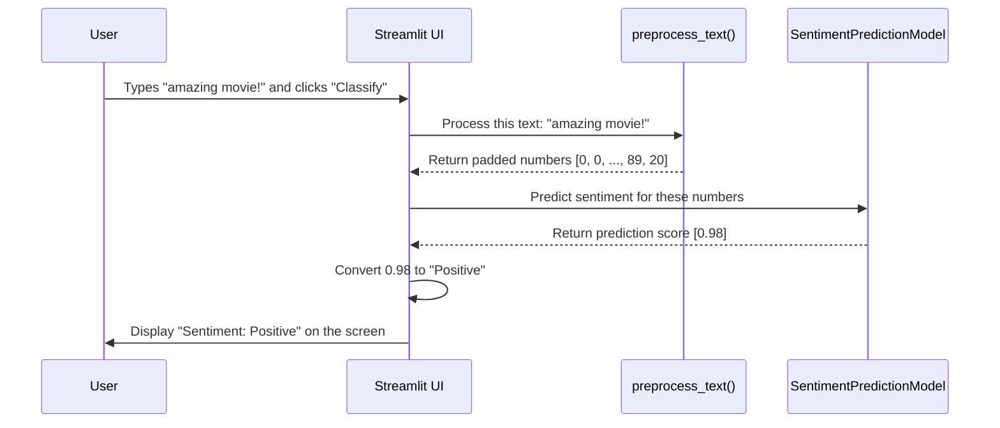

# Chapter 9: The Sentiment Analysis App

In the [previous chapter on the Sentiment Prediction Model](08_sentimentpredictionmodel.md), we loaded the "brain" of our operation. We now have all the essential pieces:
1.  A function to prepare text (`preprocess_text`).
2.  A trained model to make predictions.

But how does a regular user interact with these powerful tools? They can't be expected to run a Python script. We need a friendly, accessible front door. This is what our `SentimentAnalysisApp` provides—a simple web application where anyone can type in a review and get an instant result.

### The Goal: Building a User Interface

Our final goal is to create a simple web page that looks something like this:

**IMDB Movie Review Sentiment Analysis**
Enter a movie review to classify it as positive or negative.

[ A text box for the user to type in ]

[ Classify Button ]

*Result will appear here*

This chapter will show you how we use a fantastic library called **Streamlit** to build this interface with just a few lines of Python code. Streamlit is designed to turn data scripts into shareable web apps in minutes.

### The Code in Action: Building the App Step-by-Step

The entire user interface is built in our `main.py` file, right after our helper functions and model loading. Let's walk through it piece by piece.

#### Step 1: Importing Streamlit

First, we need to import the Streamlit library. By convention, we import it as `st`.

```python
import streamlit as st
```
This gives us access to all the commands needed to build a web interface.

#### Step 2: Creating a Title and Text

Next, we can add a title and some descriptive text to our app. It's as easy as calling `st.title()` and `st.write()`.

```python
st.title('IMDB Movie Review Sentiment Analysis')
st.write('Enter a movie review to classify it as positive or negative.')
```
When you run the app, these lines will create a large title and a paragraph of text at the top of the page.

#### Step 3: Getting User Input

We need a place for the user to type their review. The `st.text_area()` function is perfect for this. It creates a multi-line text box.

```python
# Create a text box and store the user's input in a variable
user_input = st.text_area('Movie Review')
```
Whatever the user types into this box will be saved in the `user_input` variable.

#### Step 4: Adding a Button and Tying It All Together

The magic happens when the user clicks a button. We use `st.button()` to create it. This function returns `True` if the button was just clicked, which allows us to place our core logic inside an `if` statement.

```python
if st.button('Classify'):
    # This code runs ONLY when the user clicks the button
    
    # 1. Preprocess the user's text
    preprocessed_input = preprocess_text(user_input)
    
    # 2. Make a prediction using the model
    prediction = model.predict(preprocessed_input)
    sentiment = 'Positive' if prediction[0][0] > 0.5 else 'Negative'
    
    # 3. Display the result
    st.write(f'Sentiment: {sentiment}')
    st.write(f'Prediction Score: {prediction[0][0]}')
```
This is the heart of our application! Let's break down what happens inside the `if` block:
1.  **Preprocess:** It takes the text from the `user_input` box and sends it to our all-in-one [preprocess_text](06_preprocess_text.md) function. This turns the raw text into the padded list of 500 numbers that our model needs.
2.  **Predict:** It feeds the prepared numbers into our loaded [SentimentPredictionModel](08_sentimentpredictionmodel.md), which returns a prediction score between 0 and 1. We then convert this score into a "Positive" or "Negative" label.
3.  **Display:** It uses `st.write()` again to show the final sentiment and the exact score back to the user on the web page.

### How It All Works Together: The Full Flow

Let's visualize the entire journey from a user's click to the final result.


Our Streamlit app acts as the friendly "front desk" or "receptionist." It takes the user's request, passes it to the expert functions in the back (the preprocessor and the model), and then presents the final answer back to the user in a clean, readable format.

### Conclusion

Congratulations! You have officially reached the end of our journey. You have seen how all the individual components—from the basic concept of turning words into numbers to a powerful, pre-trained neural network—can be assembled and wrapped in a user-friendly web application.

Throughout these chapters, you have learned:
*   How to prepare text for a machine learning model using **Integer Encoding**, **Padding**, and **Embeddings**.
*   How to use the official **IMDB Word Index** as a consistent codebook.
*   How to build helper functions like `preprocess_text` and `decode_review` to manage your data.
*   How to load and use a pre-trained **Recurrent Neural Network** to make predictions.
*   And finally, how to tie everything together with **Streamlit** to create a complete, interactive web app.

You've gone from the fundamental theory of Natural Language Processing to a practical, working application. We hope this step-by-step guide has demystified the process and inspired you to build your own amazing projects! Happy coding

---

Generated by [AI Codebase Knowledge Builder](https://github.com/The-Pocket/Tutorial-Codebase-Knowledge)