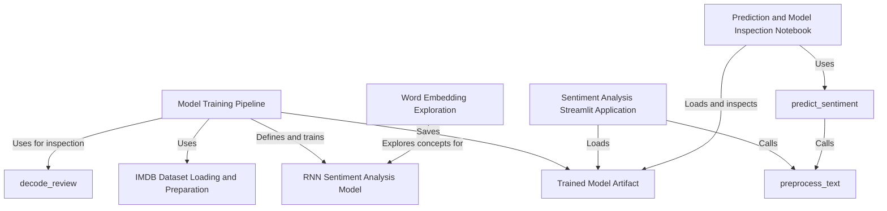

# Tutorial: imbd-Prediction-using-rnn

This project builds a *sentiment analysis* model to classify IMDB movie reviews as positive or negative. It uses a **Recurrent Neural Network (RNN)**, which is trained on the IMDB dataset and saved as a file. A simple **web application** then loads this saved model to predict the sentiment of any movie review you type in.

**Source Repository:** [https://github.com/NithishaVenkatesh/imbd-Prediction-using-rnn](https://github.com/NithishaVenkatesh/imbd-Prediction-using-rnn)

## Chapters

1. [IMDB Dataset Loading and Preparation](01_imdb_dataset_loading_and_preparation.md)
2. [decode_review](02_decode_review.md)
3. [Word Embedding Exploration](03_word_embedding_exploration.md)
4. [RNN Sentiment Analysis Model](04_rnn_sentiment_analysis_model.md)
5. [Model Training Pipeline](05_model_training_pipeline.md)
6. [Trained Model Artifact](06_trained_model_artifact.md)
7. [preprocess_text](07_preprocess_text.md)
8. [predict_sentiment](08_predict_sentiment.md)
9. [Sentiment Analysis Streamlit Application](09_sentiment_analysis_streamlit_application.md)
10. [Prediction and Model Inspection Notebook](10_prediction_and_model_inspection_notebook.md)

---

Generated by [AI Codebase Knowledge Builder](https://github.com/The-Pocket/Tutorial-Codebase-Knowledge)